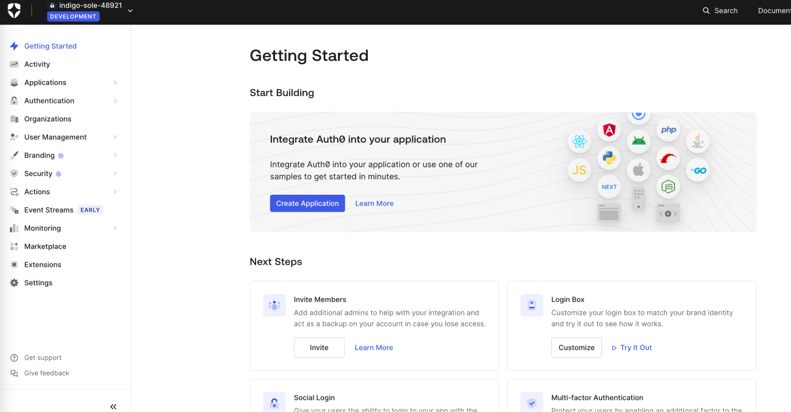
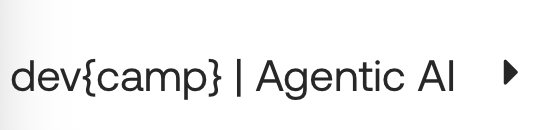
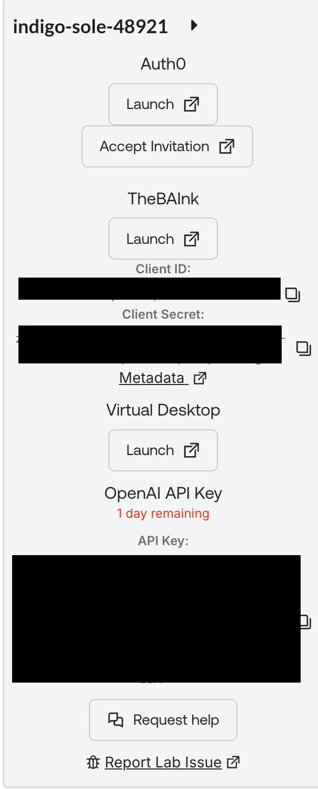

# Introduction

## Company
The bAInk, a respected local bank that has served its community for over 20 years, recently green-lit plans to modernize their existing consumer facing products and services. The bank worked with third party consultants to bring to life online banking services via a web portal and mobile application. These projects were met with great success and the bank saw a major uptick in service adoption and funds deposited into their institution. 

As a result, the bank executives began looking further to modernize their platforms. This eventually pivoted to include AI with hopes to accelerate the growth of their platforms. As a result, this initiative gave life to Aiya, the companion AI assistant created to streamline navigation of online banking services like balance transfers, account management, and online bill payments. 

## Challenges
The developers at The bAInk are facing issues figuring out what needs to be done to ensure Aiya is responding to prompts in a secure fashion. Aiya needs to be able to operate without the possibility of leaking sensitive data. We also need to ensure that per-account permissions are enforced across the board for all users interacting with Aiya. While the goal is to provide The bAInk customers with an elevated user experience, It is paramount that the data is protected with the highest levels of security and scrutiny. 

## Solution with Auth0’s Auth for Agents
In order to help The bAInk developers facilitate a secure way for Aiya to divulge sensitive information to its customers, we look to Auth0’s Auth for Agents offerings. More specifically, Fine-Grained Authorization (FGA) for RAG and Client-Initiated Backchannel Authentication (CIBA) for Async Authorization. These features will help us guide the developers towards a higher degree of security, ensuring that sensitive data is protected without sacrificing the goal of an improved user experience. 

## Before You Begin
Thanks for joining the The bAInk development team. You will be getting hands-on with configuring your own instance of an Auth0 enterprise and Auth0 FGA tenant. Additionally there will be multiple opportunities to refactor a bit of code as well to get us to a fully working application. 

You will build a demo app using Next.js (App Router) that showcases Auth0 Auth for AI Agents as well as Auth0 FGA powering RAG and securing AI tools. Your companion AI assistant Aiya will be available inside the app (once you get it spun up) to help you out.

Once the application is beginning to function, you can start to prompt Aiya for things like:

* `What am I supposed to be doing?`
* `Explain step 3` to expand on the guide.
* `hint` or `help` to get [progressively stronger] nudges
* `explain this file: {{insert file including path}}` to summarize code you’re viewing
* `Show me the code` to just see the final code.

Treat Aiya like a senior pair‑programmer. Ask precise questions. If you’re blocked, paste the error and a short description of what you tried.

Buckle up! There will be much to learn and quite a bit of code to review!

## Initial sign in to your Auth0 account
As part of the provisioning process for your Auth0 tenant, an Auth0 admin was created that corresponds to the email address that you used to sign in to labs.demo.okta.com. Your Auth0 tenant will be available for seven days for further exploration and development. To activate your tenant, follow the instructions below.

1. From the Launch Pad on the right of the screen, click on the Accept Invitation

    

2. Follow the instructions to accept the invitation

    

3. Upon successful acceptance of the invitation, you will land in the Auth0 tenant

    

## How to Navigate your Lab Guide
Before we get started, here is some information about the Labs.Demo.Okta platform you are using today.

### DevCamps Outline
On the left of the screen, you’ll find an outline of today’s mission which also serves as your navigation control panel. This devcamp - Agentic AI workshop consists of six modules, each containing subsections. You also have the ability to collapse the outline by clicking on the arrow icon.

At the bottom of each section, there's a handy control to navigate forwards and backwards between the sections.

### Launch Pad
On the right of the screen, you will find an easy way to launch your lab resources. Each resource has its own launch button along with the tenant names and credentials where applicable.

### Dynamic Lab Guide Variables
In addition to the ability to copy credentials from the Launch Pad, we've also produced this lab guide using dynamic variables. These variables will display values specific to your lab environment. For example: `DOMAIN`.

### Just a few things...

- This lab uses a combination of the Okta Demo Platform and a self-guided learning application. Feel free to switch between the two but keep in mind the content _may_ vary slightly. When in doubt, the Demo Platform is [most likely] the more accurate source of truth.

- Throughout the lab you will see types of alerts/panels like the following. They provide useful information. Take a minute to familiarize yourself with their intent so you know which ones you should _really_ pay attention to. :)

  > [!NOTE]
  > Useful information that might help you.

  > [!Tip]
  > Helpful advice for doing things better or more easily.

  > [!Important]
  > Key information you may need to know to complete the lab.

  > [!Warning]
  > Urgent info that needs your immediate attention to avoid problems.

  > [!Caution]
  > Advises about risks or negative outcomes of certain actions.

 