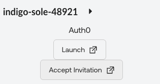

# Review Env Setup

**Module 1 Objective**

Verify that you have access to your Auth0 tenant and your local environment meets all of the requirements that are laid out in the prerequisites section of this module. It is important that the requirements are met in order for your participation in the lab to be successful.

**Prerequisites for this lab**

You must have the following:
 - **System requirements**
    - **64-bit** Windows, Mac, or Linux Laptop with Internet
    - at least **8GB** memory
    - Disabled VPN
 - **Local development environment**
    - Node.js v22.0 or v23.0
    - Integrated Code Editor (VS Code recommended)
    - Auth0 Guardian mobile app


## Verify system requirements
1. On your mac, windows, or linux machine, verify that it is **64-bit**
2. On your device, ensure that the internet connection is stable
3. If you are typically on a VPN, please disable the VPN for this lab


## Confirm Access to Auth0 Tenant

From the Launch Pad in the Lab Guide, launch into your Auth0 tenant


> [!NOTE]
>
> If there are any issues, please make sure you have accepted the invitation prior:
>
> 
>
> *If any issues continue to persist with accessing the Auth0 tenant, please flag down one of the lab assistants to troubleshoot.*

## Confirm access to an Integrated Code Editor (IDE)
We recommend using [VS Code](https://code.visualstudio.com/download)

## Confirm Node.js installation
Verify that node.js is installed and that the major version is either 22 or 23.

Run the following command through the terminal or powershell, depending on the machine you’re on.

```
node --version
```

If node.js is not installed or if the version is incorrect, please follow [this guide](https://nodejs.org/en/download/) to ensure that the right version of node is installed on your machine.
If any issues persist, please flag down a lab assistant for additional help.
> [!Warning]
>
> You may need to restart terminal or powershell after installing node.js


## Confirm Auth0 Guardian download
Make sure to download the Auth0 Guardian app on your mobile device

| App Store                                           | Google Play                                           |
| --------------------------------------------------- | ----------------------------------------------------- |
|  |  |

## Conclusion of Module 1
This module was entirely focused on making sure your access and environment were all properly configured.

You should have successfully verified your system requirements, accessed your Auth0 tenant, verified installation of v22 or v23 of node.js, verified installation of an IDE, and downloaded the Auth0 guardian application on your mobile device.

Let’s move on to the next module!
