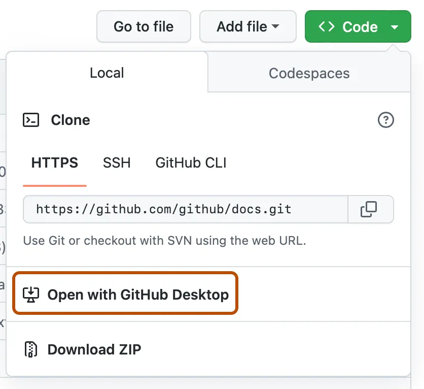

# Prepare Application Environment

**Lab 2 Objective**

Verify that a bootstrapped Regular Web Application is created in your Auth0 tenant with the correct configuration details. Successfully clone the project folder from the provided github repository. Install all the project dependencies, generate the database, and successfully start the application locally. 


**Description**

As a recap, an Auth0 tenant was created for you when you initially started the lab. Make sure you can access the tenant and can see the management dashboard. Also important to note, you will have access to this tenant for 30 days. In this lab, we will be cloning the bAInk’s demo project files from the provided github repo for local development. We will be meeting Aiya shortly at the end of this lab. 


## Verify lab bootstrap
1. From the Launch Pad in the Lab Guide, launch into your Auth0 tenant
2. From the Auth0 tenant dashboard, click on Applications
3. From the list of Applications, click on the **bAInk application** 
4. From the application settings screen, confirm that the configuration settings match:
    - Allowed Callback URLs: ```http://localhost:3000/auth/callback```
    - Allowed Logout URLs: ```http://localhost:3000```
    - Allowed Web Origins: ```http://localhost:3000```

    > [!Tip]
    > If something is missing, don’t panic – Aiya can help you manually “re-boostrap” from inside the app. Just prompt Aiya to help with this. Alternatively, you can also flag down a lab attendant for assistance

## Clone the Repo
You can clone the repo using the UI or via command line. Need a refresher on cloning a repo? No worries. We [got you](https://docs.github.com/en/repositories/creating-and-managing-repositories/cloning-a-repository).

### Command Line (easiest)

1. Clone from the repo 

    ```bash 
    git clone https://github.com/udplabs/auth0-ai 
    ```

2. Step into the project folder

    ```bash 
    cd auth0-ai 
    ```

3. Verify project files are all present

    ```bash 
    ls auth0-ai 
    ```

    <br>

    > [!NOTE]
    > You should see the following files
    > 

    <br>


<details>
<summary><h4>Alternative Option: Github Desktop</h4></summary>

***You will need to have Github Desktop installed***.

1. Navigate to the [repo](#).
2. From the main page click on the **<> Code** button.
   
3. Click on **Open with GithHub Desktop**
   
4. Follow the prompts in GitHub Desktop.

    > [!NOTE]
    > Refer to [GitHub's instructions](https://docs.github.com/en/repositories/creating-and-managing-repositories/cloning-a-repository?tool=desktop) for further details on cloning a repo using GitHub Desktop.

<br>
</details>

## Start the app
1. In your terminal or powershell, install the project dependencies using NPM

    ```bash
    npm install 
    ```
2. Once complete, run the following to generate the database:

    ```bash 
    npm run db:generate 
    ```
3. After the database is generated, run the application in development mode:

    ```bash 
    npm run dev 
    ```

    <br>

    > [!NOTE]
    > If application started successfully, you should see the following:
    >
    > 
    >
    > *If you’re having some trouble, please ask for some assistance from a lab attendant.*

<br>

## Open the app
> [!IMPORTANT]
> The app may take a few seconds the first time to boot up as it compiles. This may be the case for each page/route the first time it loads. Please be patient!

1. In a web browser (we recommend Chrome), navigate to:

    [`http://localhost:3000`](http://localhost:3000)


If everything is working as expected, Aiya will kick off a conversation with you. Aiya will help guide you through the lab (for the most part) from this point forward.


## Conclusion of Lab 2
We successfully cloned the lab project and set up the initial portion of the application. We also managed to get the app up and running on localhost. We met Aiya!
