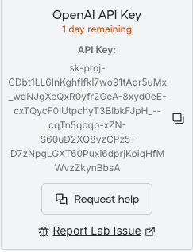
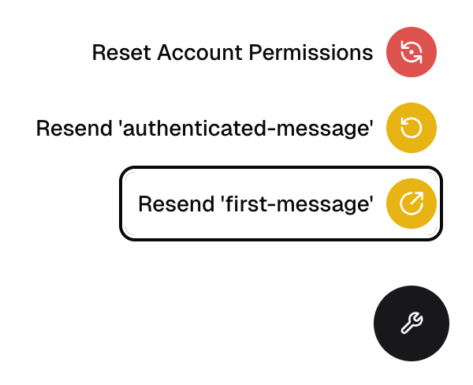

## Objective

- Copy the correct Auth0 tenant server-side variables into our local environment variable file.
- Enable Auth0’s management API through the Auth0 management dashboard.
- Accomplishing the prior tasks will allow us to successfully verify user authentication.

## Description

Now that we have successfully set up the application and it’s running in our local environment, let’s go ahead and start configuring the correct variables to ensure Aiya is able to properly respond to user prompts.

We can pull these variable values directly from our Auth0 tenant through the dashboard. We also provide some directly in this lab guide.

Next, we dive further into the dashboard to ensure that Aiya has access to the Auth0 management API in order to communicate directly with Auth0 to manage tenant resources.

Finally, we will conclude by verifying that our application is set up properly to handle user authentication and registration.

## Task 1: Update <kbd>.env</kbd> file

1. In your IDE, navigate to the <kbd>.env</kbd> file that is located in the **root** of the project folder (<kbd>./auth0-ai/.env</kbd>)

    > [!TIP]
    > Notice the following values *should be* prepopulated. 🎉
    >
    > You can click the clipboard to copy the following as-is and drop it in the <kbd>.env</kbd> file.

2. The following values are already in the <kbd>.env</kbd> file but *commented out*.

   Either **replace** the entire line OR **update** their values and **uncomment** them (*don't forget to uncomment the line!*).

    ```env
    AUTH0_DOMAIN={{idp.tenantDomain}}
    ```
    ```env
    AUTH0_CLIENT_ID={{TheBAInk.credentials.clientId}}
    ```
    ```env
    AUTH0_CLIENT_SECRET={{TheBAInk.credentials.clientSecret}}
    ```
    > [!WARNING]
    > **My values do not seem to be pre-populated. Where else can I find them?**
    >
    > The values above *should* be prepopulated.
    >
    > If you are seeing something like <kbd>{{idp.tenantDomain}}</kbd> instead of a url, follow these steps:
    >
    > 1. Navigate to the [Auth0 Demo Platform Dashboard](https://manage.cic-demo-platform.auth0app.com/dashboard).
    > 2. Select your tenant (the one created for the lab -- you probably already have it open!).
    > 3. Go to **Applications → Applications → \[the bAInk]**.
    > 4. Copy the **Domain**, **Client ID**, and **Client Secret**.

## Task 2: Generate Auth0/NextJS .env secret
Next, we need to generate a secret that the Auth0 NextJS SDK uses to encrypt the session and transaction cookies.

> [!CAUTION]
> ***You will need <kbd>openssl</kbd> to complete this step.***
>
> Windows PC user? No <kbd>>openssl</kbd>? No worries!
>
> Check out this [cool tool](https://www.cryptool.org/en/cto/openssl/) and run `openssl rand -base64 32` in the on-screen terminal.
>
> *Otherwise, continue on.*

1. In your terminal, copy and run the following command:

    ```bash
    openssl rand -base64 32
    ```

2. Copy the resulting value and add it as the <kbd>AUTH0_SECRET</kbd> variable’s value

    ```env
    AUTH0_SECRET=<randomly-generated-value>
    ```

## Task 3: Add OpenAI API Key

For this lab we have generously provided you with an OpenAI API key. This key is **not** guaranteed to last! Although it shows an expiration date, be advised that we may need to expire it early (without warning).

*To get your own API key, follow OpenAI's guides/documentation.*

1. Navigate back to the Launch Pad in the Lab Guide and copy the OpenAI API Key

    

2. Update your <kbd>.env</kbd> (or <kbd>.env.local</kbd>) file with the API Key

    ```env
    OPENAI_API_KEY="YOUR_API_KEY"
    ```

    > [!TIP]
    >
    > The Vercel AI SDK supports numerous different providers. While we are using OpenAI for this lab you can technically use any provider.
    >
    > Just be advised that each provider has slight variations in behavior and/or requirements and may not be 100% compatible with the demo application.

<br>

---
> [!NOTE]
> For ease and simplicity the lab utilizes only one <kbd>.env</kbd> file.
>
> ***We do not recommend this in a production environment.***
>
> Best practice is to keep 'secrets' or sensitive information in <kbd>.env.local</kbd>.
>
> *Rule of thumb* -- **Follow best practice for your organization.**
>
> *Refer to [NextJS documentation](https://nextjs.org/docs/app/guides/environment-variables) for additional information on how variables are handled in NextJS specifically.*
---
<br>

### Save & Restart
NextJS utilizes what is referred to as *hot reloading*, meaning that you generally do not need to stop/start the app when you make changes.

However, when it comes to <kbd>.env</kbd>, it is better to be safe.

Restart your dev server so it picks up the new environment variables:
1. Terminate the app:
<br><kbd>^</kbd> + <kbd>C</kbd> (Mac)
<br> *or*
<br><kbd>Ctrl</kbd> + <kbd>C</kbd> (PC)

2. Start the app again. *<mark>If the app does not auto-refresh, make sure to manually refresh it.</mark>*
    ```bash
    npm run dev
    ```

## Task 4: Enable Management API
This application utilizes the management API to fetch/update profile information as well as manage authenticators for MFA.

*Before it can be used, it needs to be enabled.*

1. Return to the Auth0 Admin Dashboard
2. Navigate to **Applications** → **the bAInk** → **APIs**.
3. On the **Auth0 Management API** enable **Authorized**.
   
4. Click the arrow next to the toggle to expand the menu.
5. Click to select **All**.
6. Click **Update**
   
7. On the warning that appears, click **Continue**
   

    <br>

    > [!WARNING]
    > In a production environment, we encourage a least-privilege approach -- *only grant the scopes you know you need*.
    >
    > Even better, do not call the management API directly with a user token -- use a M2M token scoped to the specific service (i.e. your <kbd>/user</kbd> API).

    <br>

*Great! Now you should be ready to test.* 🥳

## Task 5: Try it

1. Return to the open app **or** reopen the app at:

    [`http://localhost:3000`](http://localhost:3000).

2. Click **Sign up**.

    <br>

    > [!TIP]
    > If you do not see **Sign up** you can always access sign up from **Log In** as well.

    <br>

    > [!TIP]
    > For an even faster experience, try using **Continue with Google**.

    <br>

3. **Create a user.** Use any email you want but we recommend you actually have access to it.
4. **Pick a password.** *I know*... passwords are so last year. *That's another lab for another day*.

*If everything is working:*

* You will be redirected back to the app as an authenticated user.
* A message will be sent (*automatically*) to Aiya that you have *successfully authenticated*.
* From here, accounts + transactions are automatically created for you behind the scenes. 🎉
  * Feel free to click on **Accounts** if you don't believe me!


<br>

> [!TIP]
> If the above did **not** work:
>
> * Check your <kbd>.env</kbd> for typos and verify against your Auth0 tenant.
> * Open the browser console and/or server logs to check for error details.
> * Ask Aiya -- e.g. `I’m failing auth with error XYZ` (*and paste the error message*).

<br>

> [!TIP]
> You can also click the wrench icon on the right of your screen to open our custom devtools.
>
> From here, click on <kbd>Resend 'authenticated message'</kbd> to kick off the automated flow again.
>
> 


#### <span style="font-variant: small-caps">Congrats! 🥳</span>
*You have completed this module.*

You have successfully:
<ul>
  <li style="list-style-type:'✅ ';">
    configured the application with the correct environment variables pulled from your Auth0 tenant;
  </li>
  <li style="list-style-type:'✅ '">
    enabled access to Auth0’s management API through Management Dashboard;
  </li>
  <li style="list-style-type:'✅ '">
    tested user authentication in the application.
  </li>
</ul>

#### <span style="font-variant: small-caps">Let's keep moving.</span>