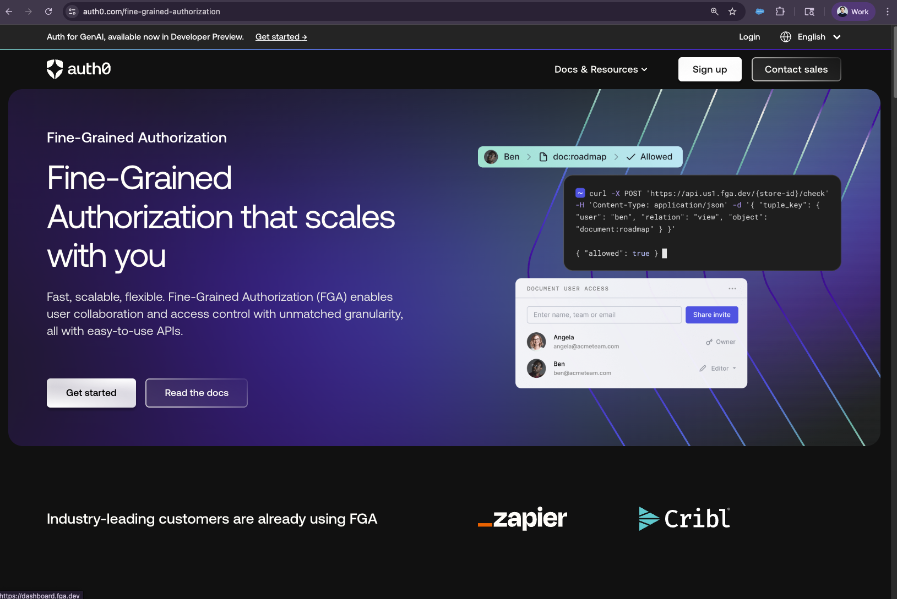
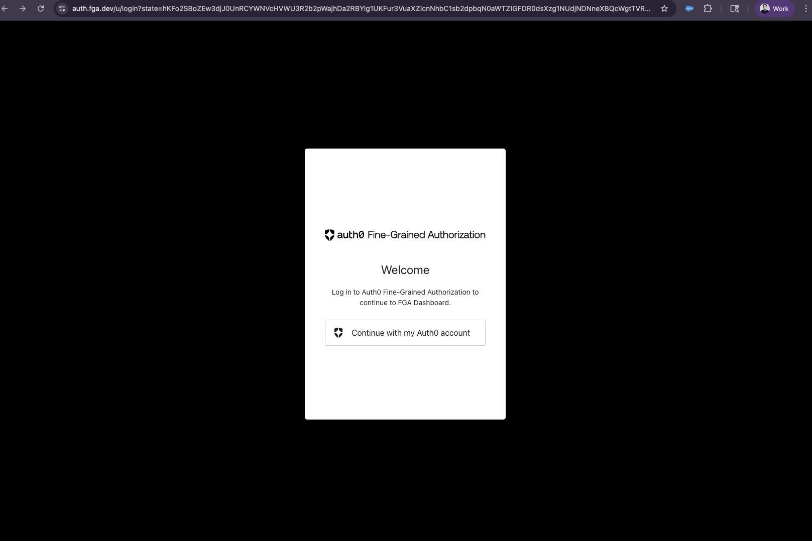
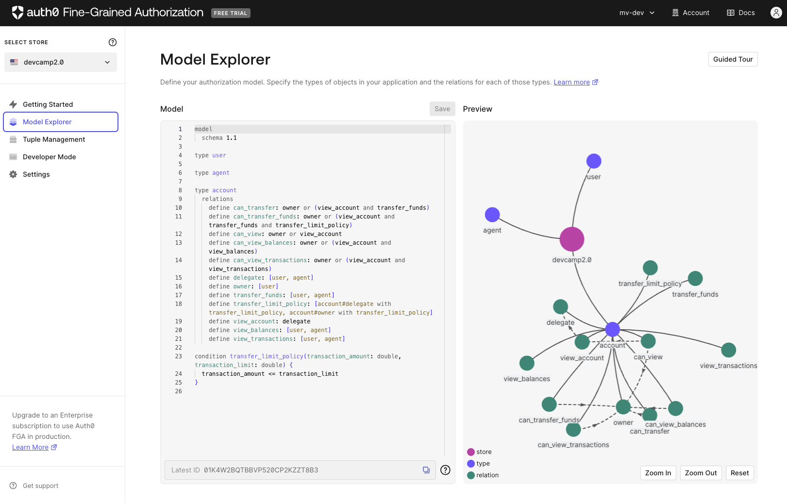
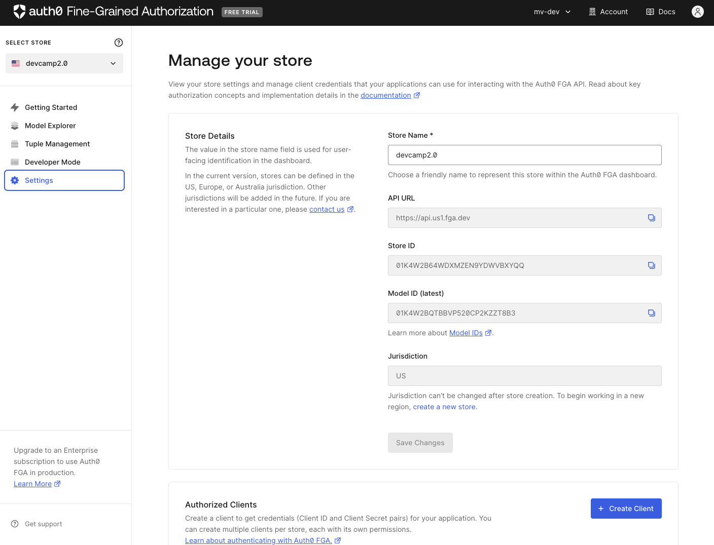
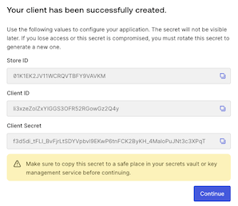

# Configure Auth0 FGA

**Lab 4 Objective**

Register for a FGA account and set up the corresponding FGA store. Configure the FGA store with the appropriate settings. Define a valid authorization model in the FGA model explorer. By setting up the FGA account, we will be able to verify that Aiya is not returning sensitive account data. Gain a general understanding of Retrieval Augmented Generation (RAG).

**Scenario**

While the focus for The bAInk is to implement AI functionality to streamline their users’ experience in their existing product lines, reigning in AI access to sensitive data is critical. This notion is crucial for The bAInk developers to understand, in order to ensure that Aiya does not return any sensitive data that it isn’t supposed to! As an end user, if you try to access your account information when you do not have the necessary permissions, Aiya should not return any results.

**Important Information and Context**

What is RAG?
That’s a great question! The more important question though is, “What isn’t RAG?”

What it **IS**:
Retrieval-Augmented Generation is a framework where a generative model (such as GPT-5) is augmented with an external retrieval mechanism. 

The process involves two main steps:
- **Retrieval**: The system fetches relevant documents or data from an external source (knowledge base, database, file system, etc.) based on the user’s query
- **Generation**: The generative model uses both the retrieved information and the original query to generate a response.

**Important Takeaways**

- RAG is a pattern, not a product or a single tool
- Retrieval can use any method to fetch relevant data, not just vector (semantic) search
- Augmentation means the model’s output is improved by grounding it in external often dynamic, information
- Generation is performed by an LLM, which uses both the query and retrieved context 

**The Challenge: Securing data in RAG pipelines**

While RAG is a powerful technique that enhanced LLMs, without proper access control, a RAG pipeline could retrieve information containing sensitive data and use them to generate a response for a user who should not have access to that data. 

Consequently, this could lead to serious data breaches and compliance violations. Simply filtering based on user roles alone is often insufficient for managing the complex, relationship-based permissions found in real-world applications. 

>[!IMPORTANT]
>For our dev{camp} we are *over simplifying* the authorization model for accounts and transactions for the sake of learning.
>
>In a real world situation, you can imagine how complex account access can get -- think of financial advisors, family accounts, even third-party aggregation software (i.e. Mint, Copilot, Lunchmoney, etc. ).

**The Solution: Auth0 Fine-Grained Authorization (FGA)**

To solve this challenge, Auth for AI Agents uses Auth0 FGA. This platform is a flexible, high-performance authorization service for applications that require a sophisticated permissions system. It implements relationship-based access control (ReBAC) to manage permissions at large-scale. 

Auth0 FGA allows you to decouple your authorization logic from your application code. Instead of embedding complex permission rules directly into your application, you define an authorization model and store relationship data in Auth0 FGA. Your application can then query Auth0 FGA at runtime to make real-time access decisions. 

**How it works with RAG**

Integrating FGA into your RAG pipeline ensures that every “document” is checked against the user’s permissions before it’s passed to the LLM (or presented to the user). 

The process works as follows: 
1. <span style='padding-right: 10px; font-variant: small-caps; font-weight: 700'>Authorization Model</span> First, you define your authorization model in Auth0 <abbr title='Fine-Grained Authorization'>FGA</abbr>. This model
specifies the types of objects (e.g., <kbd>document</kbd>), the possible
relationships between users and objects (e.g., <kbd>owner</kbd>, <kbd>editor</kbd>, <kbd>viewer</kbd>),
and the rules that govern access.

    > [!NOTE]
    > For our model we are working with <kbd>accounts</kbd>, <kbd>owners</kbd>, <kbd>delegates</kbd>, and <kbd>agents</kbd>.

2. <span style='padding-right: 10px; font-variant: small-caps; font-weight: 700'>Store Relationships</span> You store permissions as '*tuples*' in Auth0 <abbr title='Fine-Grained Authorization'>FGA</abbr>. A tuple is the core data
element, representing a specific relationship in the format of <kbd>(user, relation, object)</kbd>. For example, <kbd>user:anne</kbd> is an <kbd>owner</kbd> of
<kbd>account:12345</kbd>.

    <br>

    > [!TIP]
    > In the **US** most people say tuples (/ˈtuːpəl/) like [**too•plz**](https://ssl.gstatic.com/dictionary/static/pronunciation/2024-04-19/audio/tu/tuples_en_us_2.mp3).
    >
    > In the **UK**, most people say tuples (/ˈtjuːpəl/) [**tuh•plz**](https://dictionary.cambridge.org/media/english/uk_pron/c/cdo/cdo02/cdo0216tupluk2149.mp3)

    <br>

1. <span style='padding-right: 10px; font-variant: small-caps; font-weight: 700'>Fetch & Filter</span> When a user submits a query to your GenAI application, your backend first
fetches relevant documents from a vector database and then makes a
permission check call to Auth0 <abbr title='Fine-Grained Authorization'>FGA</abbr>. This call asks, "Is this user allowed to
view these documents?". Our AI framework SDKs abstract this and make it as
easy as plugging in a filter in your retriever tool.

    > [!NOTE]
    > For our implementation we are determining the account access available to a user/agent.

1. <span style='padding-right: 10px; font-variant: small-caps; font-weight: 700'>Secure Retrieval</span>Auth0 <abbr title='Fine-Grained Authorization'>FGA</abbr> determines if the user is authorized to access the documents. Your
application backend uses this data to filter the results from the vector
database and only sends the authorized documents to the LLM. 

## Sign Up for an FGA Account
1. Navigate to https://auth0.com/fine-grained-authorization and either login to an existing account or sign up for a new one

    

2. If you see this screen after successfully logging in or registering, click continue. If you’re asked for credentials again, provide the same credentials you used in the initial registration or login process.

    


## Create an authorization model in the FGA Store
1. In the Auth0 FGA admin console, navigate to the Model Explorer
    

2. Copy the following model and paste it into the explorer text area. What we’re doing here is defining the authorization model and creating relationships between the defined entities. Taking a look at the model, you will notice there are multiple types of entities defined that mirror our use case: a <kbd>user</kbd>, <kbd>agent</kbd>, <kbd>account</kbd>, and how they all relate to one another.

```bash
    model
    schema 1.1

    type user

    type agent

    type account
      relations

        # === Subjects (you write tuples on these) ===
        # Owners must be humans
        define owner: [user]
        # Either a human OR an agent
        define delegate: [user, agent]
        # ============================================

        # Base viewing right implied by delegation (no tuples here)
        define view_account: owner or delegate

        # === Grantable capabilities (to specific people/agents) ===
        # A basic capability flag (“this person may transfer on this account”), independent of amount.
        define transfer_funds: [user, agent]

        # Balance visibility is opt-in per user (or implicit for owners).
        define view_balances: [user, agent]
        # Transaction visibility requires both (a) being a delegate (base view) and (b) a specific grant to see transactions.
        define view_transactions: [user, agent]

        # Policy gate(s) with conditions: attach as role defaults:
        define transfer_limit_policy: [
          account#delegate with transfer_limit_policy,
          account#owner with transfer_limit_policy
        ]

        # ===== Derived checks (what your app asks for) =====
        # owners always can view
        # delegates get view via can_view
        define can_view: owner or view_account

        # owners can always view
        # delegates get view via view_account & view_balances
        define can_view_balances: owner or (view_account and view_balances)

        # owners can always view
        # delegates get view via view_account & view_balances
        define can_view_transactions: owner or (view_account and view_transactions)

        # Basic "show the transfer button" permission
        # owners can always view
        # delegates get view via view_account & view_balances
        define can_transfer: owner or (view_account and transfer_funds)

        # Enforce both visibility + capability + policy for an actual transfer
        # Nothing is implicit -- even owners need explicit permission
        define can_transfer_funds: (view_account and transfer_funds and transfer_limit_policy)
        # ============================================

    # transaction_amount is supplied at check time (from the request).
    # transaction_limit is typically stored on a tuple (or could also be supplied contextually for coarse, account-wide rules).
    condition transfer_limit_policy(transaction_amount: double, transaction_limit: double) {
    transaction_amount <= transaction_limit
    }
```

3. Click **save**.


## Create an Authorized Client for Access to the FGA SDK
1. From the FGA console, navigate to **Settings**. 
    

2. In the **Authorized Clients** section, click **+ Create Client**.

    

3. Give your client a name. It can be whatever you want but maybe something like: 

    ```
    the-bAInk
    ```

4. Select Write and delete tuples and Read and query permissions.
    
    
    > [!IMPORTANT] 
    > In normal production development we always advise least privilege access -- if your client does not *need* all the permissions, don't grant them!

5. Click Create. 

6. See the following? Success!

    

7. Before clicking on the dialog, grab the Store ID, Client ID, and Client Secret and update the following section of your .env file:

    ```env
    # ==================== OpenFGA ====================
    # Store ID from fga.dev
    FGA_STORE_ID=
    # Client ID from fga.dev
    FGA_CLIENT_ID=

    # Normally secrets should go in .env.local, but for the sake of the lab
    # we are including them here so you only have one file to edit.
    # Client Secret from fga.dev
    FGA_CLIENT_SECRET=
    # =================================================
    ``` 

    > [!TIP]
    > ***After*** clicking continue in the dialog, you will see guidance on using your new credentials.
    >
    > *Keep this dialog open for now* and refrain from selecting **Done**.
    >
    > You *might* want to refer back to this tab in the next lab section. 😉
    > 

8. Restart the application (*just to be certain everything sticks*).

    > [!NOTE]
    > Normally a full restart of the application is unnecessary -- NextJS should hot reload when <kbd>.env</kbd> changes.
    >
    > It is generally a *better* practice to restart the application.


## Test your application

1. Return to the application in the browser 
http://localhost:3000

2. Send a message to Aiya

    ```Show me my account summary```

#### No results? 🥺

If you get something like this:


and when expanded there are no results...


#### *Then it worked!* Congrats!

I know, you were expecting actual results, but this is a good thing. It means you are not seeing account data you do not have permission to view!

Head to the next step so we can work on wiring up <abbr title='Fine-Grained Authorization'>FGA</abbr> to manage our account and transaction permissions.

## Conclusion of Lab 4
We got a glimpse of what RAG is and how Auth0’s FGA product can help bridge the gap of securing data passed through RAG pipelines. Additionally, we successfully set up an FGA store and created an authorized client to be able to communicate securely with FGA from our application’s backend. Finally, we were able to successfully test that Aiya was not returning sensitive account data. 


