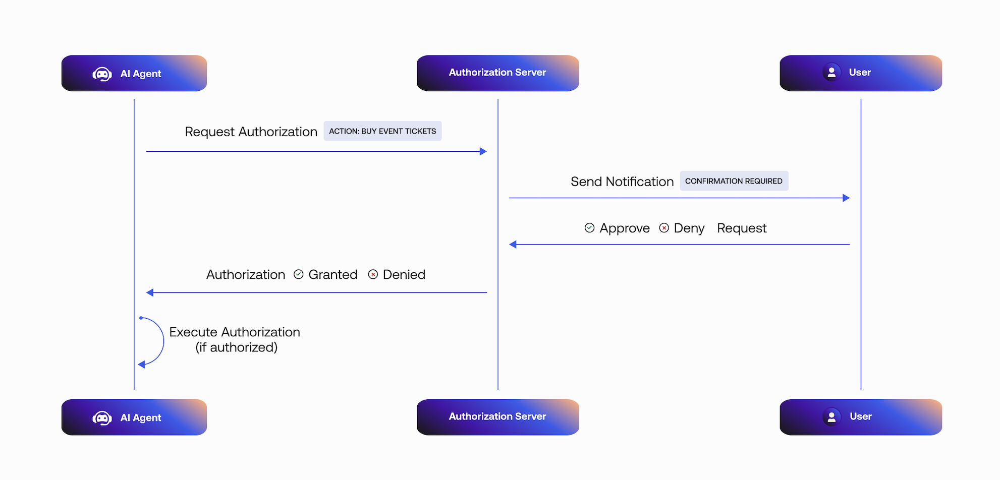
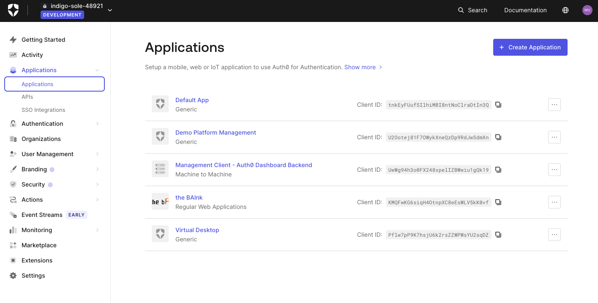
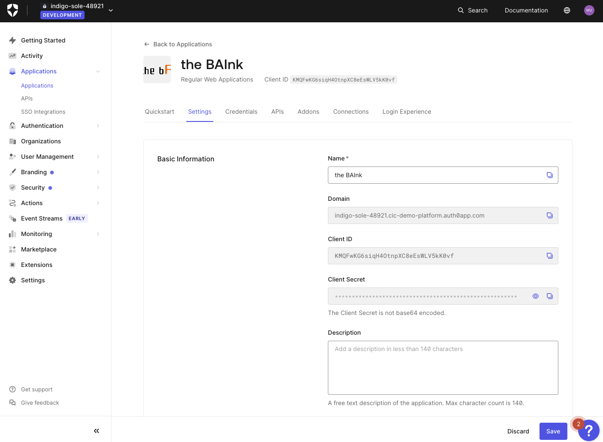

# Async Authorization with CIBA

**Lab 6 Objective**

Implement asynchronous authorization using Client-Initiated Backchannel Authorization (CIBA). This will allow the AI agent to only notify the user when needed for sensitive actions. Auth0 will be used to request the user’s permission to complete an authorization request. 

**Scenario**

The bAInk currently requires all users to transfer their funds through the online web portal or mobile application. The process is traditional and the team feels this experience could be improved. The executives at The bAInk have determined that they would like to allow Aiya to transfer funds on behalf of their customers but they emphasized that this was extremely risky. They need to ensure that Aiya is capable of completing this action in a secure fashion. This is where Auth0 and CIBA can help bridge the gap.

**Introduction**

The Asynchronous Authorization process is dependent on a decoupled authentication flow where a user provides consent on a trusted device, such as their mobile phone, to complete a specific transaction or action. 

Some common use cases for asynchronous authorization are:
- **Transactional approvals**: An agent processing a purchase order may need a user’s final approval before funds are dispersed. 
- **Accessing sensitive data**: An agent might need to access protected financial information to answer a query 
- **Executing high-privilege tasks**: An agent may need permission to create a dispute ticket on behalf of a user for an unknown credit card charge. 

## TODO: Auth0 Guardian vs Guardian SDK

For today’s lab we will be using the Auth0 Guardian app. If you do not currently have it, you will need to download it from either the Apple App Store or Google Play Store. 

|App Store|Google Play|
|---------|-----------|
|||

## Enable CIBA in your Auth0 tenant 

**Client-Initiated Backchannel Authentication (CIBA)** is an OpenID Foundation specification that defines the decoupled flow referenced earlier, allowing a client application (Aiya’s backend) to initiate an authentication request without direct interaction from the user on the same device. This allows the user to approve or deny the request on a separate, trusted device (like a mobile phone), in this case, via a mobile push notification to an authenticator app.

1. From the Okta Lab Guide Launch Pad, click Launch to access your Auth0 tenant
    
    

2. In the Auth0 tenant, navigate to Applications

    

3. Click on the bAInk application 

    

4. Scroll to the bottom until you see Advanced Settings. 
Click on Grant Types and enable **Client Initiated Backchannel Authentication (CIBA)**.

    

5. Click **Save**.

## Enable Guardian Push in your Auth0 tenant
1. Navigate to your Auth0 tenant

## Enroll your user to use Auth0 Guardian
Do this through Aiya

## Require async authorization for your tool

In this lab, Aiya will be able to transfer funds on behalf of the user. When the user approves the transaction and the CIBA flow is completed, the AI agent responds with a funds transferred message. An error is returned if the user denies the transaction. 

WIP
Navigate to ACCOUNTS
Try transferring funds (ERROR)
API is checking if the user is authorized
Current access token does not have appropriate audience
Navigate to Auth0 Tenant > Applications > APIs
Create API ​​https://localhost:3000/api/accounts/transfers
Use RFC9068
Create
Click Permissions
Permission: create:transfer
Description: Initiate an account transfer
Add
Navigate to Applications > Applications > the bAInk > APIs
Enable API we just created
Enable create:transfer
Update > Continue
Open lib/auth0/ai.ts
Instantiate new Auth0AI()
Add auth0AI withAsyncUserConfirmation
Add getUser to lib/auth0/client.ts
DONE FOR THEM
Explain what/why this helper exists
(used all over project)
Open lib/ai/tools/transfer-funds.ts
Wrap tool w/ withAsyncAuthorization
Add a binding message
EXPLAIN: binding message is only useful w/ RAR
Does not do anything w/ Auth0 Guardian at this time.
Replace the following in the description
Always confirm the details of the transfer with the user before continuing.
With:
The user will receive a push notification to provide confirmation. DO NOT REQUIRE CONFIRMATION FROM THE USER.

WHY: The description provides the model with instructions on how to use a tool. As the model is running it checks each tool in the registry to determine whether or not to use it. The instructions provided in both the system prompt (outside this file) and the tools themselves are what guide the model. 
When you first transferred funds you likely noticed that Aiya required you to approve the transfer. For the lab, we want to require push authorization on every transaction.
In reality, you would likely want to implement a more appropriate policy. (FGA can help!)

Create and wrap the tool with 

Integrate the tool with Aiya

Test the application

Restart the application with npm run dev. Navigate to http://localhost:3000
Ask the AI agent to transfer funds. Now look for a push notification from the Auth0 Guardian app. Once you approve the notification, the funds should transfer and you will see a response from Aiya!

TODO: NOTE/ASIDE

What’s happening here? 
You will notice the transferFunds tool has a very specific inputSchema…. 

Etc. etc. 
