# Async Auth


## Objective

Implement **Human-in-the-Loop approval(s)** in your application to secure agentic actions using asynchronous authorization via **Client-Initiated Backchannel Authorization (CIBA)**. This will allow the AI agent to engage a user on demand for sensitive actions. Auth0 will be used to request the user’s permission to complete an authorization request.

#### Technical Details
The Auth0 AI SDK offers a few different convenience methods to help with Vercel’s AI SDK. In this module we will be implementing a wrapped version of <kbd>withAsyncAuthorization</kbd> as well as the <kbd>getCIBACredentials</kbd> method.

## Scenario

**the bAInk** currently requires all users to transfer their funds through the online web portal or mobile application. The process is traditional and the team feels this experience could be improved. The executives at **the bAInk** have determined that they would like to allow Aiya to transfer funds on behalf of their customers but they emphasized that this was extremely risky. They need to ensure that Aiya is capable of completing this action in a secure fashion. This is where Auth0 and <abbr title='Client-Initiated Backchannel Authorization'>CIBA</abbr> can help bridge the gap.

## Introduction

The **Asynchronous Authorization** process is dependent on a decoupled authentication flow where a user provides consent on a trusted device, such as their mobile phone, to complete a specific transaction or action.

Some common use cases for **Asynchronous Authorization** are:
- **Transactional approvals**: An agent processing a purchase order may need a user’s final approval before funds are dispersed.
- **Accessing sensitive data**: An agent might need to access protected financial information to answer a query
- **Executing high-privilege tasks**: An agent may need permission to create a dispute ticket on behalf of a user for an unknown credit card charge.

## How it works

The <abbr title='Client-Initiated Backchannel Authorization'>CIBA</abbr> Flow does not rely on a client application redirecting the user via the browser to perform the login/authentication process. Instead, the client application directly calls the OpenID Provider via a backchannel request to initiate the authentication flow.

The <abbr title='Client-Initiated Backchannel Authorization'>CIBA</abbr> Flow does not create or update a grant. As a result, if the client application requests a given scope via the <abbr title='Client-Initiated Backchannel Authorization'>CIBA</abbr> Flow, it won’t be stored as a grant if the user consents. This means that if configured, a different authentication flow (grant type) requesting the same scope(s) must prompt the user again for OAuth consent.

Because the <abbr title='Client-Initiated Backchannel Authorization'>CIBA</abbr> Flow does not have sessions i.e. browser cookies, the user does not have to be authenticated before a <abbr title='Client-Initiated Backchannel Authorization'>CIBA</abbr> challenge. If they were already authenticated before a <abbr title='Client-Initiated Backchannel Authorization'>CIBA</abbr> challenge, their existing session is not affected.

<figure>
	
	<figcaption>
		<ul>
			<li style="list-style-type:'❶'">The <b>AI Agent</b> (<i>server</i>) initiates some action – like buying event tickets.
			<li style="list-style-type:'❷'">The <b>AI Agent</b> service begins polling waiting for a response</li>
			<li style="list-style-type:'❸'">The authorization server (<i>Auth0</i>) receives a <kbd>POST</kbd> request and triggers the notification via your configured service.</li>
			<li style="list-style-type:'❹'"><kbd>OPTIONAL:</kbd> <i>If using <abbr title=”Rich Authorization Request”>RAR</abbr></i> the native app retrieves the <kbd>bindingMessage</kbd> containing the “rich” consent/transactional details – such as the price and/or number of tickets being purchased.</li>
			<li style="list-style-type:'❺'">The <b>user</b> interacts with their device and approves/denies the request.</li>
			<li style="list-style-type:'❻'">The authorization server completes the flow and the <b>AI Agent</b> service retrieves the result via the <kbd>/token</kbd> endpoint.</li>
		<li style="list-style-type:'❼'">The <b>AI Agent</b> receives tokens and completes the action</li>
		</ul>
	</figcaption>
</figure>

### Auth0 Guardian vs Auth0 Guardian SDK: *What’s the diff?*

***Auth0 Guardian*** is a mobile application for iOS and Android devices that allows users to complete <abbr title='Multi-factor Authentication'>MFA</abbr> with push notifications or temporary one-time passwords. It can deliver push notifications to users’ enrolled devices (typically mobile phones or tablets) or generate one-time passwords directly within the app. Users can then quickly respond to these push notifications or retrieve a one-time password to complete their login.

***Auth0 Guardian SDK*** lets you embed the same push and one-time password capabilities directly inside your own native application. Auth0 handles the backend (unless you opt for AWS SNS), device enrollment, and verification – *but your app owns the UX*.

#### Why Implement the SDK?
- **Own the UX & brand.** No app-switching to Auth0 Guardian; seamless, on-brand approvals in your app.
- **Stronger step-up flows.** Gate push approvals with device biometrics (Face/Touch/Android Biometrics) before confirming.
- **Better control & telemetry.** Customize enrollment/notifications, tie trusted devices to users, and surface device state to your app logic.
- **Offline resilience.** Support OTP fallback when the device has poor connectivity.
- **Fewer support hiccups.** Build recovery/reset flows that match your product, not a generic app.
- **Works with advanced flows.** Plays nicely with Universal Login, APIs, and async auth (aka <abbr title='Client-Initiated Backchannel Authorization'>CIBA</abbr>) – used in this very task!

<br>

|                             | Auth0 Guardian                            | Auth0 Guardian SDK               |
| --------------------------- | ----------------------------------------- | -------------------------------- |
| Push Notifications          | ⚠️ Auth0-branded                           | ✅ Fully customizable             |
| One-time password           | ✅                                         | ✅                                |
| Biometric Security          | ⚠️ User opt-in                             | ✅ Fully customizable             |
| Telemetry                   | ⚠️ Basics via logs/monitoring              | ✅ Fully customizable             |
| Offline fallback            | ⚠️ TOTP/backup codes (*via certain flows*) | ✅ You control                    |
| Rich Authorization Requests | ❌ *Coming soon!*                          | ✅ Fully customizable             |
| Implementation Effort       | ✅ Turn-key / Toggle                       | ⚠️ Custom code                    |
| Hosted Service              | ✅Auth0                                    | ⚠️ (AWS SNS or Platform Specific) |

<br>

For this task, we will be using the **Auth0 Guardian app**. If you do not currently have it, you will need to download it from either the Apple App Store or Google Play Store.

<br>

| App Store                                               |     | Google Play                                                    |
| ------------------------------------------------------- | --- | -------------------------------------------------------------- |
|  |     |  |

<br>

## Task 1: Enable CIBA

Client-Initiated Backchannel Authentication (<abbr title='Client-Initiated Backchannel Authorization'>CIBA</abbr>) is an OpenID Foundation specification that defines the decoupled flow referenced earlier, allowing a client application (Aiya’s backend/server) to initiate an authentication request without direct interaction from the user on the same device. This allows the user to approve or deny the request on a separate, trusted device (like a mobile phone), in this case, via a mobile push notification to the Auth0 Guardian app.

1. From the Okta Lab Guide Launch Pad, click Launch to access your Auth0 Tenant (*if not already open*).

    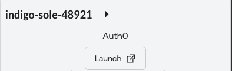

2. In the Auth0 tenant, navigate to **Applications** > **Applications**

    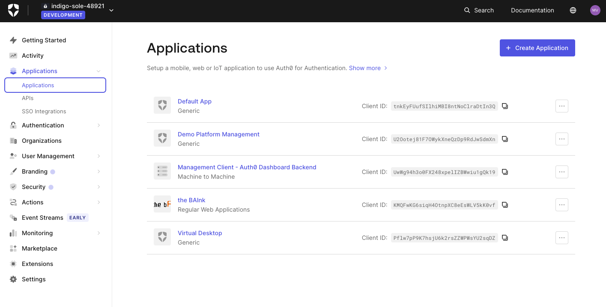

3. Click on **the BAInk** application

    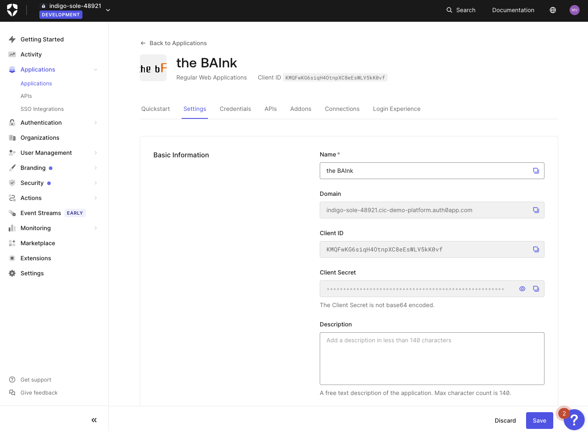

4. Scroll to the bottom until you see **Advanced Settings**. Click on **Grant Types** and enable **Client Initiated Backchannel Authentication (CIBA)**.

    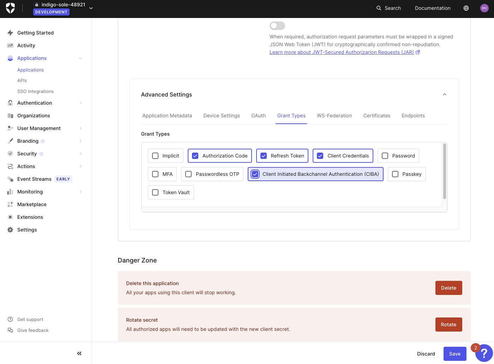

5. Click **Save**.

#### <span style="font-variant: small-caps">Congrats!</span>
*You have completed Task 1.*

## Task 2: Enable Guardian Push
1. From the **Auth0 Management Dashboard** navigate to **Security** > **Multi-factor Auth** > **Push Notification using Auth0 Guardian**.
2. Toggle the feature **on**.

    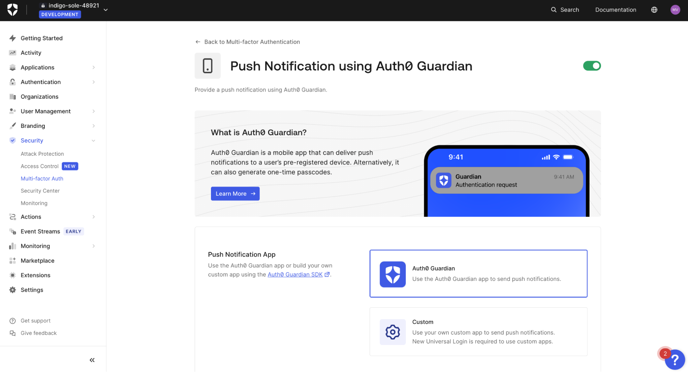

#### <span style="font-variant: small-caps">Congrats!</span>
*You have completed Task 2.*

## Task 3: Try It Out

Before we move forward with this module's task, let’s see what the app can do and learn a few things.

1. Return to the app (http://localhost:3000), open the upper left sidebar menu, and click on **Accounts**.
2. Choose an account, any account, and click on **Transfer**.
3. Select an account to transfer to as well as a dollar amount (go crazy!).
4. Click **Transfer Now**.

	***Did it work?***

	***Was it supposed to?***

	*What do you think?* Should you have been able to move funds? 🤔

You *are*, after all, authenticated so... **yes**! ***You should be able to transfer funds directly.***

<br>

> [!NOTE]
>
> There are a lot of different ways to handle this scenario, including using <abbr title=”Fine-Grained Authorization”>FGA</abbr>.
>
> If you would like to discuss alternative approaches, either *Ask Aiya* or ask a lab attendant.

<br>

For our application (*and demo purposes*) we have **two** ‘services’ that exist:
- A ***user*** transfer service.
- An ***agent*** transfer service.

In a real-world application this may not make sense, but we are not in the real-world, right? 😀

### Let’s take a look at the code.

1. In your code editor, open `app/(accounts)/api/accounts/transfers/route.ts`.

   *What do you see?*

2. *Take a moment to read through the code and understand the implementation.*
   - This is a fairly basic <kbd>POST</kbd> call that interfaces with a data API (which interfaces with a database). Because this endpoint is part of our NextJS application, ‘authorization’ *could* have easily be handled using Auth0’s SDK.
   - Assuming the user is authenticated, the <kbd>POST</kbd> endpoint completes the transfer.

#### *But what about Aiya?*

3. Navigate back to the app (`https://localhost:3000`), and start a new chat by clicking the <kbd>+</kbd> button.
1. Ask Aiya to transfer $25 from one account to another - for example: ```transfer $25 from checking to savings``` (*or whatever account you have available*).
1. Wait…
   - Aiya is fetching an account list behind the scenes to be able to build the request payload (account ids, etc.).
1. Aiya will ask to confirm the transaction. Go ahead and **confirm** by typing ```Yes``` or something similar.

	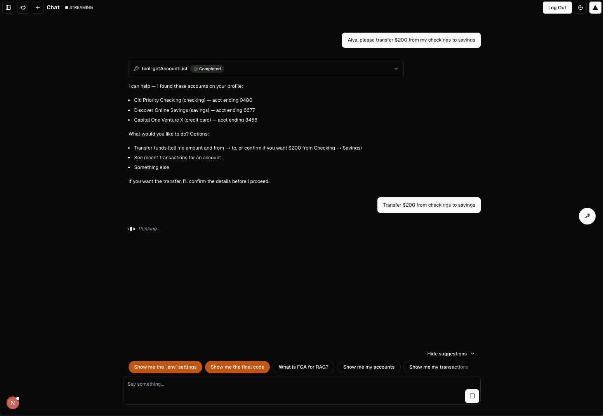

1. It's ok! You ***should*** be seeing an <mark>error</mark> (*failure*).

	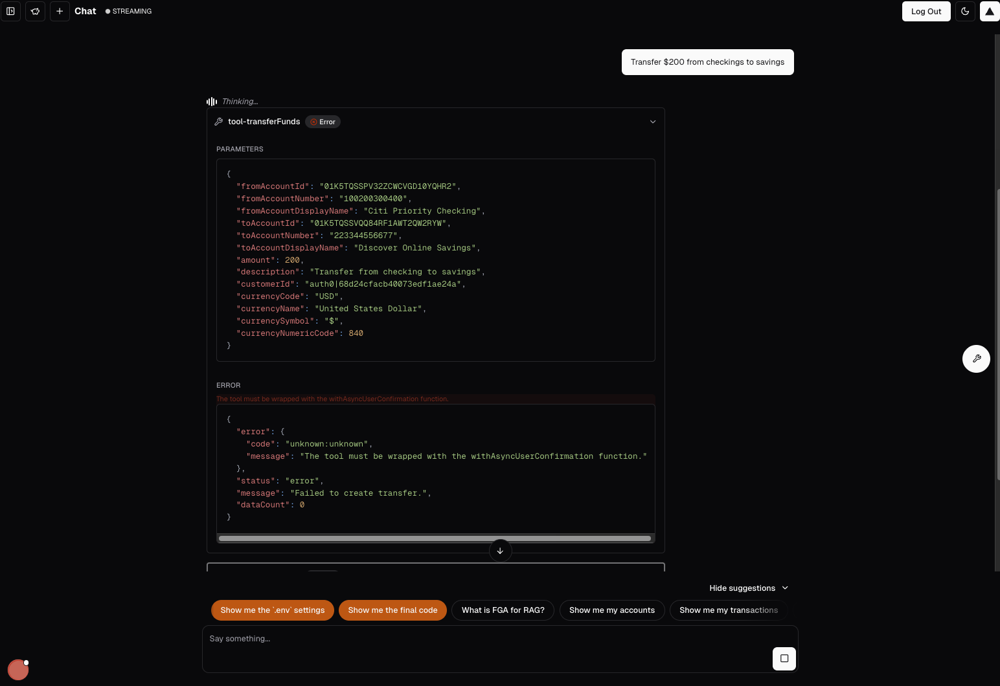

#### But why? It worked for ***me***!

Because our application has security! Or, at least a demonstration of security. 😆

### Let’s take a look at the code.
1. Open `app/(accounts)/api/accounts/[id]/route.ts`.

   	*What do you see?*

1. *Take a moment to read through the code and understand the implementation.*
1. You will notice this endpoint uses the same <kbd>transferFunds</kbd> data service but this one has implemented <mark>JWT validation</mark>.

	<br>

	> [!NOTE]
	> For the demo, we are simulating a “public” endpoint that could be called by anyone/anything.
	>
	> *We know, it does not necessarily make sense in a NextJS app. Just go with it (for now).*

	<br>

1. The <kbd>verifyJwt</kbd> function is specifically looking for:
	- your tenant as the <kbd><abbr title='issuer'>iss</abbr></kbd>;
	- a specific/custom audience + your tenant’s <kbd>/userinfo</kbd> audience;
	- the token <kbd><abbr title='subject or user_id'>sub</abbr></kbd>;
	- the presence of the <kbd>create:transfer</kbd> scope.

**REMINDER**: This approach is to demonstrate how you potentially can (*and probably should*) treat your Agent’s differently than your users. By doing so you gain a lot of flexibility/control over when/how agents can act on behalf of a user – API audiences, scopes, token lifetime, custom claims, etc.

<br>

> [!NOTE]
>
> Want to take it further? Token exchange!
>
> That gets into advanced API authorization, which is outside the scope of this task.
>
> Curious? Let’s chat!

<br>

<mark>Let's keep moving!</mark>

#### <span style="font-variant: small-caps">Congrats!</span>
*You have completed Task 3.*

## Task 4: Create an API

1. From your Auth0 management dashboard, navigate to **Applications**  > **APIs**.
2. Click **+Create API**.
3. Enter `http://localhost:3000/api/accounts/transfers` for both the **Name** and **Identifier**.

  	***You are welcome to change this value, just make sure to update it elsewhere throughout the application**.*

	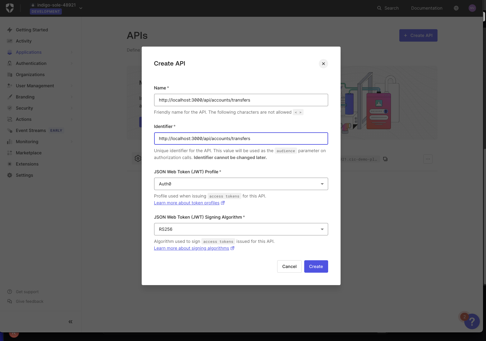

1. Click **Create**.

1. Click on **Permissions**

1. Under **Add a Permission** enter:

 	| Field           | Value                 |
 	| --------------- | --------------------- |
 	| **Name**        | `create:transfer`     |
 	| **Description** | `Initiate a transfer` |

7. Click **+ Add**

	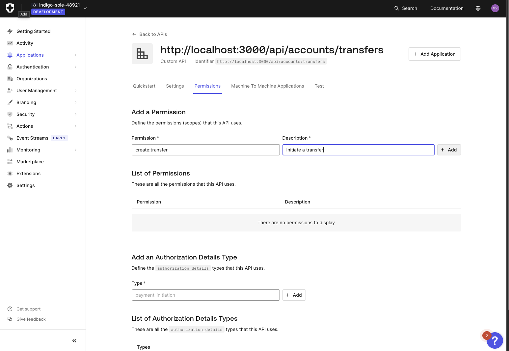

1. Now, navigate to the **Machine to Machine Applications** tab.

1. Scroll down to **the BAInk** application and toggle **on** for Authorization.

1. Click on the expand arrow.

1.  Select the newly created permission: <kbd>create:transfer</kbd>.

	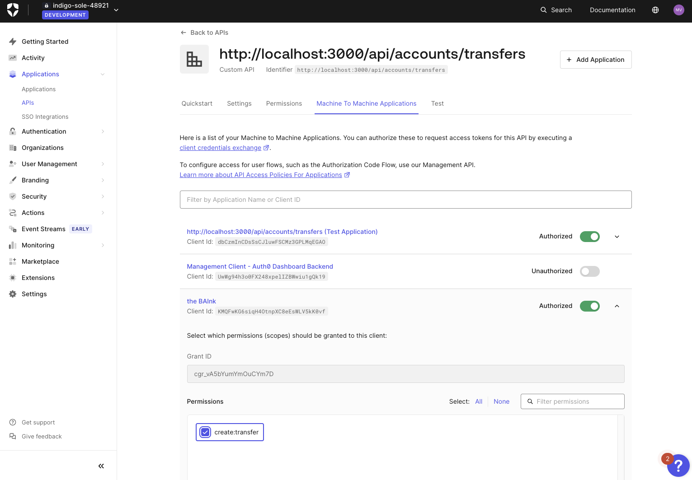

1.  Click **Update** and **Continue**.

---
#### <span style="font-variant: small-caps">Congrats!</span>
*You have completed Task 4.*

Everything works now, right? 🤣 <mark><i>Let’s keep moving…</i></mark>

---

## Task 5: Init AI Client

1. In your code editor, open `lib/auth0/ai/client.ts`.
1. Take a moment to review the code. *It should look familiar!*
   	- We used a very similar pattern when implementing the <abbr title='Fine-grained Authorization'>FGA</abbr> client in `lib/auth0/fga/client.ts`.
1. ***There isn’t anything to do here*** – we just wanted you to be aware that in order to proceed you would need to instantiate the Auth0AI SDK (somewhere).

---
#### <span style="font-variant: small-caps">Congrats!</span>
*You have completed Task 5.* 😁🥳

---

## Task 6: Create Wrapper

### <span style="font-variant: small-caps">Goal</span>
Return an instance of `auth0AI.withAsyncUserConfirmation` that:
1. Properly handles when the user starts authorization and streams status updates/messages to ensure the UX is good.

2. Properly handles errors/failures.

***This one is a doozy! Ready to learn?***

<span style="font-variant: small-caps; font-weight: 700">Setup</span>

- Open your code editor and open `lib/auth0/ai/with-async-authorization.ts`.

<br>

> [!TIP]
> *Similar to previous modules, you will notice the code is heavily documented with numerous instructions/guides to aid you in completing the task.*

<br>

<span style="font-variant: small-caps; font-weight: 700">Steps</span>

1. ~~Initialize Auth0AI client singleton.~~ _<span style='color: green; font-variant: small-caps'>← Done for you</span>_

2. ~~Guard against a missing Auth0AI client (*defensive coding*)~~ _<span style='color: green; font-variant: small-caps'>← Done for you</span>_

3. Add the custom scope (aka 'permission') we created earlier to the existing scopes array.

4. Ensure the <kbd>userID</kbd> parameter is a <mark>promise</mark> that returns the user’s ID.

	i.e. <kbd>getUser</kbd> → <kbd>user.sub</kbd>

5. Insert the <kbd>audience</kbd> value we created earlier.

6. Enhance <kbd>onAuthorizationRequest</kbd> by using our custom <kbd>handleOnAuthorize</kbd> helper function.

<br>

> [!NOTE]
>
> TODO: EXPLAIN FUNCTION

<br>

7. Ensure any errors (i.e. from `onUnauthorized`) are *normalized*.

  	This is where you *could* handle cases where the user denies authorization.

	You could differentiate between denial, missing enrollment, and generic errors, etc. by using the normalized errors from the SDK, for example:
      - <kbd>AccessDeniedInterrupt</kbd>
      - <kbd>UserDoesNotHavePushNotificationsInterrupt</kbd>

		*Check out the SDK types (`node_modules/@auth0/ai/dist/esm/interrupts/CIBAInterrupts.d.ts`) for more.*

	<br>

	> [!TIP]
	>
	> This wrapper returns to a *tool*, which then returns to the *streaming function*.
	>
	> How does the *tool* handle/return errors? 🤔
	>
	> Refer to **Step 4**: try passing an *async function* that returns an error object.
	> 	- The goal is to ensure that an error is returned *gracefully* if it occurs and does not 'throw' or *halt* the current action entirely.
	> 	- If the function halts processing the Agent will not be able to properly triage and find alternatives solutions.

	<br>

8. Spread the incoming options so they are passed along to <kbd>withAsyncUserConfirmation</kbd>

	```diff
	- // 	...options, /** 👀 ✅ Step 8: The Auth0AI wrapper spreads the same options as our wrapper! TypeScript interface to the rescue? 🧐 */
	+ ...options,

9.  Ensure the tool being wrapped is *actually injected*!
	```diff
	- // })(tool) /** ✅ Step 9: Don't forget to inject the `tool` being wrapped! */;
	+ })(tool);
	```

---
#### <span style="font-variant: small-caps">Congrats!</span>
*You have completed Task 6.*

### TODO: Add summary of what we did
You successfully...

---

## Task 7: Wrap the Tool

#### <span style="font-variant: small-caps">Goal</span>
Use the Auth0AI <kbd>withAsyncConfirmation</kbd> we just wrapped to ensure the <kbd>transferFunds</kbd> tool does not run without proper authorization by requiring it to fetch a fresh *and ephemeral* access token.

<span style="font-variant: small-caps; font-weight: 700">Setup</span>

- From your code editor, open `lib/auth0/ai/transfer-funds.ts`.

<span style="font-variant: small-caps; font-weight: 700">Steps</span>

1. Wrap <kbd>transferFunds</kbd> with <kbd>withAsyncAuthorization</kbd>.

	You will need to:
      - import the function from the `lib/auth0/ai` directory.
      - *wrap the tool* -- instead of simply returning it, pass it as the <kbd>tool</kbd> parameter of <kbd>withAsyncAuthorization</kbd>.
      - <kbd>transferFunds</kbd> should ultimately *still return* the original tool.
      - <kbd>bindingMessage</kbd> can be a simple string like `Please approve the transfer.`

	<br>

	> [!NOTE]
	>
	> ***What is <kbd>bindingMessage</kbd>?***
	>
	> When using the Auth0 Guardian SDK this message can be displayed to the user in order to provide context about the request. It is *not* used in our demo but still required.

	<br>

2. Import <kbd>getCIBACredentials</kbd> and use it to retrieve an <kbd>accessToken</kbd> to be sent in the <kbd>Authorization</kbd> header of the API call.

3. Update the tool <kbd>description</kbd>.
	- Right now the tool states to always require confirmation. However, we are implementing confirmation via push notification so having Aiya confirm first would be very annoying.
	- Read the <kbd>description</kbd> and modify the instructions so Aiya *never* asks for confirmation.

		<br>

		> [!TIP]
		> When instructing <abbr title='large language models'>LLMs</abbr> be explicit but concise.

		<br>

---
#### <span style="font-variant: small-caps">Congrats!</span>
*You have completed Task 7.*

At this point you could *technically* use the tool. If Aiya attempted to run the tool, the Auth0 AI <kbd>withAsyncConfirmation</kbd> would be triggered and the user would receive a push notification.

However, the user experience is lacking. Feel free to give it a try, just know you'll be missing out on a better UX!

We recommend you *wait* until you have finished the module.

*Let's make the UX better.*

---

## Task 8: Enhance the UX

> [!NOTE]
> *This task is technically **optional***.
>
> **However**, learning how to use the Vercel AI SDK's datastream writer almost anyway in your app is pretty useful and cool.
>
> Not feeling up for it? Skip ahead to testing.
>
> ***Just be aware your experience may vary slightly from the experience outlined in this guide.***

#### <span style="font-variant: small-caps">Goal</span>
To enhance the user's experience we need a way to *inject* the streaming writer into `withAsyncAuthorization` so the authorization portion of the flow (where the push notification gets sent) can stream *status messages* to the chat UI.

The plain exported tool has no place to accept that writer.

Although this is *not* a requirement to enable the feature functionality, it sure does make for a better user experience!

#### <span style="font-variant: small-caps"><em>What</em> are we doing?</span>

I'm glad you asked...
- We “lift” (aka *wrap*) the existing wrapper in a function that takes <kbd>writer</kbd> and returns the authorized tool instance.
- Then we call it a "higher-order factory" to sound cool. 😎

---
##### What is a “higher-order factory”?***

*A long, long time ago...* 🤭

It is just a *fancy word for a fancy function*!

##### What a higher-order factory <span style="font-variant: small-caps"><em>is</em></span> and what it is <span style="font-variant: small-caps"><em>not</em></span>

Let’s not dive *too deep* into Javascript, but maybe we can learn a few things:

- It is <span style="font-variant: small-caps; font-weight: 700">not</span> a <kbd>class</kbd>.
- Javascript is not an object-oriented programming language – there was no such thing as a class until introduced in ES6.
- A <kbd>class</kbd> is *a syntactic sugar coating* around constructor functions + prototypes. In other words, just *an alternative way* of doing things.
- Classes…
	- create instances with methods shared on the prototype;
	- support <kbd>extends</kbd>, <kbd>super</kbd>, static methods, and now (as of ES2022) <kbd>#private</kbd> fields.
- It <span style="font-variant: small-caps; font-weight: 700">is</span> a <kbd>factory</kbd>.
- A factory is a function that returns an object, often containing methods and/or private state (via closures).
- Although it is similar to one, it is <span style="font-variant: small-caps; font-weight: 700">not</span> a [*currying function*](https://javascript.info/currying-partials)
- It <span style="font-variant: small-caps; font-weight: 700">is</span> technically a *wrapper*.
- Or, more accurately, a *wrapper* around a *wrapper*.

***If you are wanting to know more, ask Aiya or flag down a lab attendant for further guidance.***

---

#### <span style="font-variant: small-caps"><em>Why</em> are we doing this?</span>

In the Vercel AI SDK, the datastream writer is what streams messages from Aiya to the chat interface. To control the datastream writer, you control the world!

OR, maybe just Aiya? ¯\\\_(ツ)_/¯

Either way, it's a powerful tool. In order to properly update the UI and provide a better user experience, <kbd>withAsyncAuthorization</kbd> needs the datastream writer (specifically for <kbd>onAuthorizationRequest</kbd>).

Without being able to stream message updates, the user is left with a loading indicator and no indication of what is happening. Not good!

<br>

<mark>***Let's begin!***</mark>

<br>


<br>

#### <span style="font-variant: small-caps">Steps</span>

1. Open `lib/ai/tools/transfer-funds.ts`. *This is the tool that Aiya uses to transfer funds.*

   <br>

	> [!TIP]
	> *Similar to previous modules, you will notice the code is heavily documented with numerous instructions/guides to aid you in completing the task.*

	<br>

2. Implement a “higher-order factory” (*fancy name for a fancy function*) that injects a datastream <kbd>writer</kbd> into the <kbd>withAsyncAuthorization</kbd> function.

	<br>

	> [!IMPORTANT]
	> ***This can be a confusing concept, but it's an incredibly easy task. Stay with us!***
	>
	> <span style="font-variant: small-caps; font-weight: 900">tl/dr</span>
	>
	> **Before Factory**
	>
	>  We would have used the <kbd>Auth0AI</kbd> wrapper, which, similar to our wrapper, permits passing additional arguments while maintaining the original tool's shape.
	>
	> **After Factory**
	>
	> We can pass <kbd>writer</kbd> into the <kbd>Auth0AI</kbd> function to be used before returning the original tool.

	<br>

	*What are we actually doing?*
      - We need to pass the datastream <kbd>writer</kbd> into the <kbd>withAsyncAuthorization</kbd> so that we can *use it* in the <kbd>onAuthorizationRequest</kbd> to stream updates to the user.
      - *But we also need to keep the tool response in the expected shape for the Vercel SDK.*

	***SOLUTION***: “higher-order factory”! We need to “wrap the wrapper”!
		- Simply create a function that *returns* the wrapped tool.

	<br>

	> [!TIP]
	>
	> We will give you a hint...
	>
	>
	> ```diff
	> - export const transferFunds = /* ✅ TASK 7 - STEP 1: */ withAsyncAuthorization({
	> + export const transferFunds = /* ✅ TASK 8 */ () => withAsyncAuthorization({...
	> ```

	<br>

---
#### <span style="font-variant: small-caps">Congrats!</span>
*You have completed Task 8.*

Super easy, right? It just sounds complicated.

*Now you know how to 'inject' the datastream writer. Imagine all the things you can do now!*

---

### Task 9: Update Registry

This one is an easy one, promise! In order for Aiya to know that a tool exists, the needs to be added to the *tool registry*.

We attempted a transfer with Aiya earlier so the tool is *clearly in the registry*. However, we have ***changed*** the tool.

In the previous task we transformed <kbd>transfer-funds</kbd> into a higher-order factory function. ***Now we need to call it***.

*Let’s make sure it is entered into the registry correctly.*

<span style="font-variant: small-caps; font-weight: 700">Steps</span>

1. Open `lib/ai/tool-registry.ts`.
2. Simply change <kbd>transferFunds</kbd> → <kbd>transferFunds()</kbd>
	```diff
	- transferFunds
	+ transferFunds()
	```
3. Open ```app/(chat)/api/chat/[id]/_handlers/post.ts```
4. Scroll to **line 81** and ***uncomment*** ```transferFunds()```. You may see a red underline, this can be ignored. ```transferFunds()``` does not require an arg to compile and run. The writer arg is *optional*
	```diff
	- // transferFunds: transferFunds(),
	+ transferFunds: transferFunds(),
	```

	***But, where is the datastream writer?***

	Ultimately we want to call <kbd>transferFunds</kbd> with a datastream writer, but we do not have that available *yet*. That is why it was necessary to make the <kbd>writer</kbd> *optional*.

	Once the datastream writer is available, in the actual <kbd>createUIMessageStream</kbd> execute function, we can *re-initialize* transferFunds with the datastream writer. Nifty trick, *right*? 🤓

5. Let's do that now! Scroll to **line 110** and ***uncomment*** ```transferFunds: transferFunds(dataStream)```, and remove the line above it.

	```diff
	- transferFunds,
	- // transferFunds: transferFunds(dataStream),
	+ transferFunds: transferFunds(dataStream),
	```

> [!NOTE]
>
> The code in the <kbd>POST</kbd> function is on the ***advanced*** side of the Vercel SDK implementation.
>
> If you are not familiar with Vercel’s AI SDK, it might seem overwhelming – but it’s not as crazy as you’d think.
>
> If you’re interested in learning more, ask Aiya (*or a lab attendant*).

---
#### <span style="font-variant: small-caps">Congrats!</span>
*You have completed Task 9.*

Only one more to go...

---


## Task 10: Try it

1. Restart the application with:

	```bash
	npm run dev
	```

2. Navigate to `http://localhost:3000`

3. Ask the Aiya to transfer funds from your checking to savings, (*or whichever accounts you would like*).

	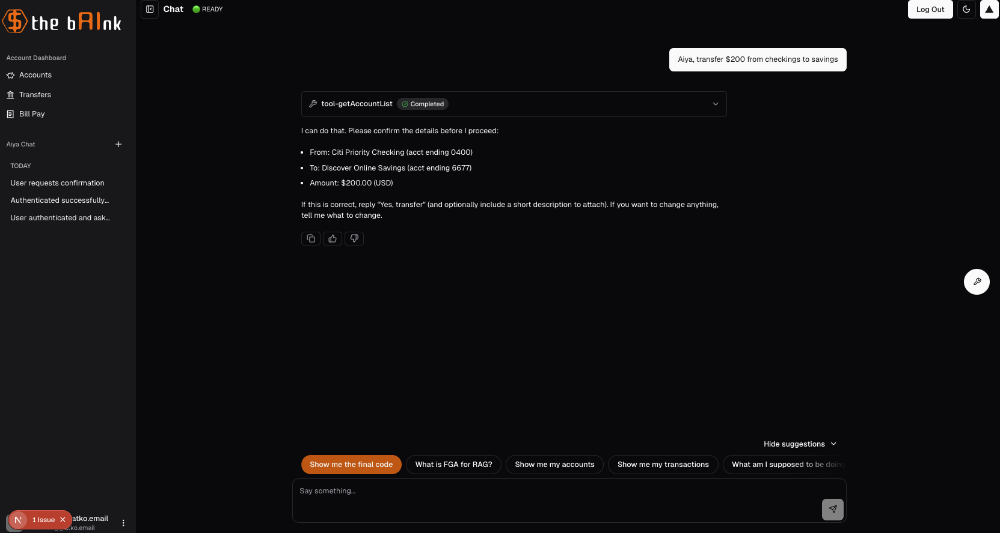

4. Confirm that you would like to transfer funds.

	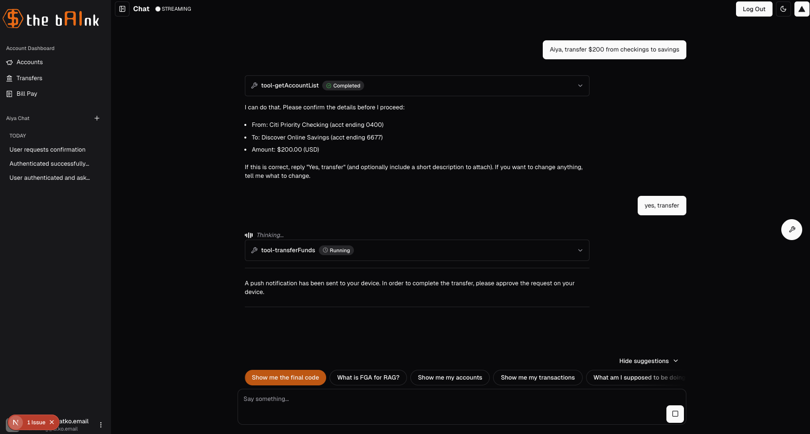

	> [!NOTE]
	>
	> If Aiya isn't sending you a push notification, or you know that you haven't enrolled in push yet, follow Aiya's prompts. 
	>
	> You will be prompted to enroll in push notification through **Auth0 Guardian**. 

	<br>

5. Now look for a push notification in the **Auth0 Guardian app**.

	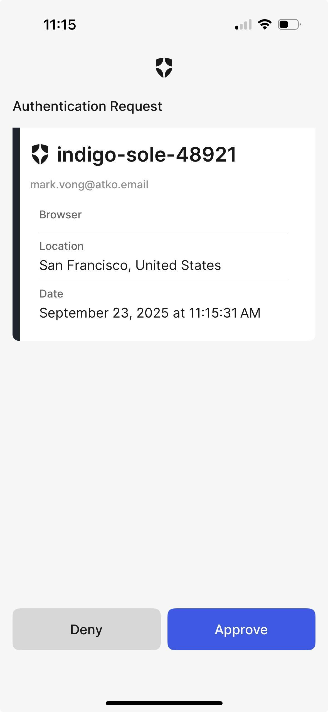

5. Once you approve the notification, the funds should transfer and you will see a response from Aiya!

	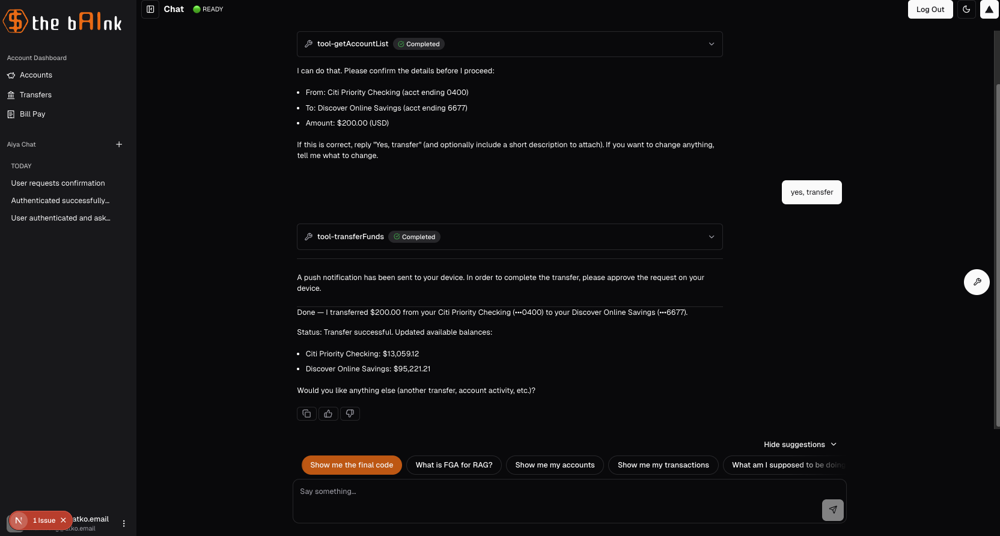

	

---
#### <span style="font-variant: small-caps">Congrats!</span>
*You have completed the entire module.* Thank you for sticking with us!

This was a very engaging module with quite a bit of code to analyze and refactor. Throughout this module, we were able to set up successfully the funds transfer functionality through Aiya. To accomplish this, we incorporated **CIBA** into the application and successfully used Auth0 Guardian Push to provide secure funds transfers!
