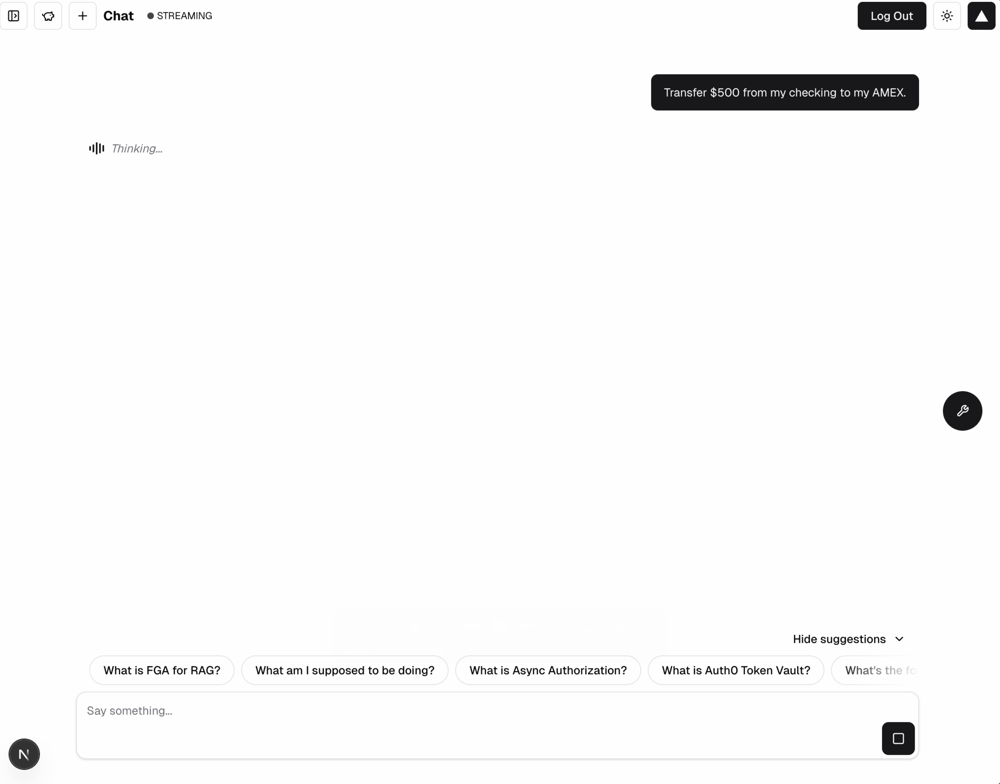

# Async Authorization with CIBA


**Module 6 Objective**

Implement **Human-in-the-Loop approval(s)** in your application to secure agentic actions using asynchronous authorization via **Client-Initiated Backchannel Authorization (CIBA)**. This will allow the AI agent to engage a user on demand for sensitive actions. Auth0 will be used to request the user’s permission to complete an authorization request. 

**Scenario**

**The bAInk** currently requires all users to transfer their funds through the online web portal or mobile application. The process is traditional and the team feels this experience could be improved. The executives at **the bAInk** have determined that they would like to allow Aiya to transfer funds on behalf of their customers but they emphasized that this was extremely risky. They need to ensure that Aiya is capable of completing this action in a secure fashion. This is where Auth0 and <abbr title=”Client-Initiated Backchannel Authorization”>CIBA</abbr> can help bridge the gap.

**Introduction**

The **Asynchronous Authorization** process is dependent on a decoupled authentication flow where a user provides consent on a trusted device, such as their mobile phone, to complete a specific transaction or action. 

Some common use cases for **Asynchronous Authorization** are:
- **Transactional approvals**: An agent processing a purchase order may need a user’s final approval before funds are dispersed. 
- **Accessing sensitive data**: An agent might need to access protected financial information to answer a query 
- **Executing high-privilege tasks**: An agent may need permission to create a dispute ticket on behalf of a user for an unknown credit card charge. 

**How it works**

The <abbr title=”Client-Initiated Backchannel Authorization">CIBA</abbr> Flow does not rely on a client application redirecting the user via the browser to perform the login/authentication process. Instead, the client application directly calls the OpenID Provider via a backchannel request to initiate the authentication flow.

The <abbr title=”Client-Initiated Backchannel Authorization">CIBA</abbr> Flow does not create or update a grant. As a result, if the client application requests a given scope via the <abbr title=”Client-Initiated Backchannel Authorization">CIBA</abbr> Flow, it won’t be stored as a grant if the user consents. This means that if configured, a different authentication flow (grant type) requesting the same scope(s) must prompt the user again for OAuth consent. 

Because the <abbr title=”Client-Initiated Backchannel Authorization">CIBA</abbr> Flow does not have sessions i.e. browser cookies, the user does not have to be authenticated before a <abbr title=”Client-Initiated Backchannel Authorization">CIBA</abbr> challenge. If they were already authenticated before a <abbr title=”Client-Initiated Backchannel Authorization">CIBA</abbr> challenge, their existing session is not affected.

<figure>
	
	<figcaption>❶ The <b>AI Agent</b> (<i>server</i>) initiates some action – like buying event tickets.</figcaption>
	<figcaption>❷ The <b>AI Agent</b> service begins polling waiting for a response</figcaption>
<figcaption>❸ The authorization server (<i>Auth0</i>) receives a <kbd>POST</kbd> request and triggers the notification via your configured service.</figcaption>
<figcaption>❹ <kbd>OPTIONAL:</kbd> <i>If using <abbr title=”Rich Authorization Request”>RAR</abbr></i> the native app retrieves the <kbd>bindingMessage</kbd> containing the “rich” consent/transactional details – such as the price and/or number of tickets being purchased.</figcaption>
	<figcaption>❺ The <b>user</b> interacts with their device and approves/denies the request.</figcaption>
	<figcaption>❻ The authorization server completes the flow and the <b>AI Agent</b> service retrieves the result via the <kbd>/token</kbd> endpoint.</figcaption>
	<figcaption>❼ The <b>AI Agent</b> receives tokens and completes the action</figcaption>
</figure>


**Auth0 Guardian vs Auth0 Guardian SDK: What’s the diff?**

***Auth0 Guardian*** is a mobile application for iOS and Android devices that allows users to complete <abbr title=”Multi-factor Authentication>MFA</abbr> with push notifications or temporary one-time passwords.

***Auth0 Guardian*** can deliver push notifications to users’ enrolled devices (typically mobile phones or tablets) or generate one-time passwords directly within the app. Users can then quickly respond to these push notifications or retrieve a one-time password to complete their login.

***Auth0 Guardian SDK*** lets you embed the same push and one-time password capabilities directly inside your own native application. Auth0 handles the backend (unless you opt for AWS SNS), device enrollment, and verification – but your app owns the UX. 

**Why Implement the SDK?**	
- Own the UX & brand. No app-switching to Auth0 Guardian; seamless, on-brand approvals in your app.
- Stronger step-up flows. Gate push approvals with device biometrics (Face/Touch/Android Biometrics) before confirming.
- Better control & telemetry. Customize enrollment/notifications, tie trusted devices to users, and surface device state to your app logic.
- Offline resilience. Support OTP fallback when the device has poor connectivity.
- Fewer support hiccups. Build recovery/reset flows that match your product, not a generic app.
- Works with advanced flows. Plays nicely with Universal Login, APIs, and async auth (aka <abbr title=”Client-Initiated Backchannel Authorization”>CIBA</abbr>) – used in this very task!

<br>

|                             | Auth0 Guardian                             | Auth0 Guardian SDK                |
| --------------------------- | ------------------------------------------ | --------------------------------- |
| Push Notifications          | ⚠️ Auth0-branded                           | ✅ Fully customizable             |
| One-time password           | ✅                                         | ✅                                |
| Biometric Security          | ⚠️ User opt-in                             | ✅ Fully customizable             |
| Telemetry                   | ⚠️ Basics via logs/monitoring              | ✅ Fully customizable             |
| Offline fallback            | ⚠️ TOTP/backup codes (*via certain flows*) | ✅ You control                    |
| Rich Authorization Requests | ❌ *Coming soon!*                          | ✅ Fully customizable             |
| Implementation Effort       | ✅ Turn-key / Toggle                       | ⚠️ Custom code                    |
| Hosted Service              | ✅Auth0                                    | ⚠️ (AWS SNS or Platform Specific) |

---

<br>

For this task, we will be using the **Auth0 Guardian app**. If you do not currently have it, you will need to download it from either the Apple App Store or Google Play Store. 


| App Store | Google Play |
| ------------ | ---------- |
|  |  |


## Enable <abbr title=”Client-Initiated Backchannel Authorization”>CIBA</abbr> in your Auth0 tenant 

Client-Initiated Backchannel Authentication (<abbr title=”Client-Initiated Backchannel Authorization”>CIBA</abbr>) is an OpenID Foundation specification that defines the decoupled flow referenced earlier, allowing a client application (Aiya’s backend/server) to initiate an authentication request without direct interaction from the user on the same device. This allows the user to approve or deny the request on a separate, trusted device (like a mobile phone), in this case, via a mobile push notification to the Auth0 Guardian app.

1. From the Okta Lab Guide Launch Pad, click Launch to access your Auth0 Tenant (if not already open).

    

2. In the Auth0 tenant, navigate to Applications

    

3. Click on **the BAInk** application 

    

4. Scroll to the bottom until you see Advanced Settings. Click on Grant Types and enable **Client Initiated Backchannel Authentication (CIBA)**.

    

5. Click **Save**.


## Enable Guardian Push in your Auth0 tenant
1. From the **Auth0 Management Dashboard** navigate to **Security** > **Multi-factor Auth** > **Push Notification using Auth0 Guardian**.
2. Toggle the feature **on**.

    

## Initial Testing of Funds Transfer
Before we move forward with the task, let’s see what the app can do. 
1. Return to the app (http://localhost:3000) and click on **Accounts**.
2. Choose an account, any account, and click on **Transfer**.
3. Select an account to transfer to as well as a dollar amount (go crazy!).
4. Click **Transfer Now**.

***Did it work? Was it supposed to?***

What do you think? Should you have been able to move funds? 

Well, you *are* authenticated…so **yes**! **You should be able to transfer funds directly.** 

Important to note, there are a lot of different ways to handle this scenario, including using <abbr title=”Fine-Grained Authorization”>FGA</abbr>. 

For our application (and demo purposes) we have **two** ‘services’ that exist:
1. A ***user*** transfer service.
2. An ***agent*** transfer service.

In a real-world application this may not make sense, but we are not in the real-world, right? 😀

## Let’s go ahead and take a look at the code.

1. In your code editor, open ```app/(accounts)/api/accounts/transfers/route.ts```. *What do you see?*
2. *Take a moment to read through the code and understand the implementation.*
3. This is a fairly basic <kbd>POST</kbd> call that interfaces with a data API (which interfaces with a database). 
Because this endpoint is part of our NextJS application, ‘authorization’ can easily be handled using Auth0’s SDK.
4. Assuming the user is authenticated, the <kbd>POST</kbd> endpoint completes the transfer.

## But what about Aiya?
1. Navigate back to the app, https://localhost:3000, and start a new chat.
2. Ask Aiya to transfer $25 from one account to another for example:
	
	<kbd>transfer $25 from checking to savings</kbd> (or whatever account you have available).

3. Wait… Aiya is fetching an account list behind the scenes to be able to build the request payload (account ids, etc.).
4. Aiya will ask to confirm the transaction. Go ahead and **confirm**.

	

5. Oh no! You **should** be seeing an error/failure.

	

## But why? It worked for ***me***!
Because our application has security! Or, at least a demonstration of security. 😆 Let’s take a look at the code.
1. Open ```app/(accounts)/api/accounts/[id]/route.ts```. *What do you see?*
2. *Take a moment to read through the code and understand the implementation.*
3. You will notice this endpoint uses the same ```transferFunds``` data service but this one has implemented **JWT validation**. 

	> [!NOTE]
	> For the demo, we are simulating a “public” endpoint that could be called by anyone/anything. 
	>
	> We know, it does not necessarily make sense in a NextJS app. Just go with it (for now). 

4. The ```verifyJwt``` function is specifically looking for:
	- your tenant as the issuer;
	- a specific/custom audience + your tenant’s <kbd>/userinfo</kbd> audience;
	- the token <kbd>sub</kbd>;
	- the presence of the <kbd>create:transfer</kbd> scope.

This approach, again, is to demonstrate how you potentially can (and probably should) treat your AI Agent’s differently than your users. By doing so you gain a lot of flexibility/control over when/how agents can act on behalf of a user – API audiences, scopes, token lifetime, custom claims, etc.

> [!NOTE]
>
> Want to take it further? Token exchange! 
>
> That gets into advanced API authorization, which is outside the scope of this task. 
>
> Curious? Let’s chat!

***Let’s get to work!***

## Create an API
1. From your Auth0 management dashboard, navigate to **Applications**  > **APIs**.
1. Click **+Create API**.
3. Enter ```http://localhost:3000/api/accounts/transfers``` for both the **Name** and **Identifier**.
4. **You are welcome to change this value, just make sure to update it elsewhere throughout the application**.
	
	

5. Click **Create**.

7. Click on **Permissions** 

8. Under **Add a Permission** enter:

	| Field           | Value                 |
	| --------------- | --------------------- |
	| **Name**        | `create:transfer`     |
	| **Description** | `Initiate a transfer` |

9. Click **+ Add**

	

10. Now, navigate to the **Machine to Machine Applications** tab.

11. Scroll down to **the BAInk** application and toggle **on** for Authorization.

12. Click on the expand arrow.

13. Select the newly created permission: <kbd>create:transfer</kbd>.

	

14. Click **Update** and **Continue**.

Great! Now everything should work, right? 🤣 <mark>Let’s keep moving…</mark>

## Require Async Authorization for your tool

The Auth0 AI SDK offers a few different convenience methods to help with Vercel’s AI SDK. In this module we will be implementing withAsyncAuthorization (slightly modified) and getCIBACredentials.

### Task 1

1. In your code editor, open ```lib/auth0/ai/client.ts```.
2. Take a moment to review the code. *It should look familiar!* We used a very similar pattern when implementing the <abbr title=”Fine-grained Authorization”>FGA</abbr> client in ```lib/auth0/fga/client.ts```.
3. ***There isn’t anything to do here*** – we just wanted you to be aware that in order to proceed you would need to instantiate the Auth0AI SDK (somewhere).

Congrats! You completed **Task 1**. 😁🥳

### Task 2

This one is a doozy! Ready to learn? 

1. In your code editor, open ```lib/auth0/ai/with-async-authorization.ts```.

Similar to previous modules, you will notice the code is heavily documented with numerous instructions/guides to aid you in completing the task. 

1. ~~Initialize Auth0AI client singleton.~~ _<span style='color: green; font-variant: small-caps'>← Done for you</span>_

2. ~~Guard against a missing Auth0AI client (*defensive coding*)~~ _<span style='color: green; font-variant: small-caps'>← Done for you</span>_

3. Return an instance of ```auth0AI.withAsyncUserConfirmation```

    1. Add the custom scope (permission) we created earlier to the existing scopes array.

	2. Ensure the ```userID``` parameter is a promise that returns the user’s ID.

		- i.e. <kbd>getUser</kbd> → <kbd>user.sub</kbd>

	3. Insert the <kbd>audience</kbd> value we created earlier.

	4. Enhance ```onAuthorizationRequest``` by using our custom ```handleOnAuthorize``` helper function.

		> [!NOTE]
		> 
		> TODO: EXPLAIN FUNCTION

	5. Ensure any errors (i.e. from ```onUnauthorized```) are normalized
		> [!TIP]
		>
		> This wrapper returns to a tool, which then returns to the streaming function.
		>
		> How does the tool handle/return errors? 🤔
		>
		> Similar to **Step 3.2**, try passing an async function that returns an error object, we want to ensure that an error is returned gracefully if it occurs.

	6. Spread the incoming options so they are passed along to ```withAsyncUserConfirmation```

	7. Ensure the tool being wrapped is *actually* injected!

### Task 3 : Inject datastream writer using a "<i>higher-order factory</i>"

**Goal**<br>
We need a way to inject the streaming writer into ```withAsyncAuthorization``` so the authorization phase (push MFA) can stream status messages to the chat UI. This requires using the datastream writer. 
The plain exported tool has no place to accept that writer. So we “lift” (wrap) it in a function that takes writer and returns the authorized tool instance.

***What’s a “higher-order factory”?***<br>
Just a fancy word for a fancy function! Let’s not dive too deep into Javascript, but maybe let’s learn a few things. 

*So what is it?* And, what is it **not**?
- It is not a ```class```.
	- Javascript is not an object-oriented programming language – there was no such thing as a class until introduced in ES6. 
	- A ```class``` is a syntactic sugar coating around constructor functions + prototypes. An alternative way.
	- Classes…
		- create instances with methods shared on the prototype;
		- support ```extends```, ```super```, static methods, and now (as of ES2022) #```private``` fields;
- It is a ```factory```.
	- A factory is a function that returns an object, often containing methods and/or private state (via closures).


- It is a ***wrapper***. Or, more accurately, a *wrapper* around a *wrapper*.
- It is not a [<i>currying</i> function](https://javascript.info/currying-partials)

***If you are still unsure, please flag down a lab attendant for further guidance.***

***Let's begin implementing!***

Open ```lib/ai/tools/transfer-funds.ts```. This is the tool that Aiya uses to transfer funds.

You will notice the code is *heavily* documented. Follow the in-code ‘guide’ to complete the **four** steps.

1. Wrap the existing tool with ```withAsyncAuthorization```.
	- You will need to import the method from the ```lib/auth0/ai``` directory.
	- ```transferFunds``` should be the result of invoking ```withAsyncAuthorization```.
	- ```bindingMessage``` can just be a simple string like ```Please approve the transfer```.

		> [!NOTE]
		> 
		> What is bindingMessage?
		> When using the Auth0 Guardian SDK this message can be displayed to the user in order to provide context about the request.
 
2. Import ```getCIBACredentials``` and use it to retrieve an ```accessToken``` to be sent in the ```Authorization``` header of the API call.

3. Implement a “higher-order factory” (*fancy name for a fancy function*) that injects a datastream ```writer``` into the ```withAsyncAuthorization``` function. 

	*This step might be confusing. What are we actually doing?*
	 - We need to pass the datastream ```writer``` into the withAsyncAuthorization so that we can use it in the ```onAuthorizationRequest``` to stream updates to the user. 
	 - *But we also need to keep the tool response in the expected shape for the Vercel SDK.*
	 - ***SOLUTION***: “higher-order factory” of sorts. We need to “wrap the wrapper”! 
	 - The outcome will be a factory function that will return the *result of* ```withAsyncAuthorization```.


4. Update the <kbd>tool description</kbd> *(line 68)*.
	- Right now the tool states to always require confirmation. However, we are implementing confirmation via push notification so having Aiya confirm first would be very annoying. 
	- Change the instructions so Aiya never asks for confirmation.

	> [!TIP]
	> When instructing <abbr title=”large language models”>LLMs</abbr> be explicit but concise.

### Task 4

This last one is an easy one, promise! In order for Aiya to know that a tool exists, it needs to be added to the *tool registry*. 

We attempted a transfer with Aiya earlier so the tool is clearly in the registry. However, we have changed the tool. Let’s make sure it is entered into the registry correctly.

1. Open ```lib/ai/tool-registry.ts```

In the previous task we transformed ```transfer-funds``` into a higher-order factory function. ***Now we need to call it***.

1. Simply change ```transferFunds``` → ```transferFunds()```
	```diff
	- transferFunds
	+ transferFunds()
	```
2. Open ```app/(chat)/api/chat/[id]/_handlers/post.ts```
3. Scroll to **line 81** and ***uncomment*** ```transferFunds()```. You may see a red underline, this can be ignored. ```transferFunds()``` does not require an arg to compile and run. The writer arg is optional
	```diff
	- // transferFunds: transferFunds(),
	+ transferFunds: transferFunds(),
	```
4. Scroll to **line 110** and ***uncomment*** ```transferFunds: transferFunds(dataStream)```, and remove the line above it.

	```diff
	- transferFunds,
	- // transferFunds: transferFunds(dataStream),
	+ transferFunds: transferFunds(dataStream),
	```

***But, why?***

Ultimately we want to call ```transferFunds``` with a datastream writer, but we do not have that available yet. That is why it was necessary to make the ```writer``` *optional*. 

Once the datastream writer is available, in the actual ```createUIMessageStream``` execute function, we can re-initialize transferFunds with the datastream writer. Nifty trick, *right*? 🤓

This <kbd>POST</kbd> code is on the ***advanced*** side. If you are not familiar with Vercel’s AI SDK, it might seem overwhelming – but it’s not as crazy as you’d think. 

If you’re interested in learning more, ask Aiya (or a lab attendant). 


## Initiate funds transfer with Aiya!

1. Restart the application with:
	
	```bash
	npm run dev
	```

2. Navigate to http://localhost:3000

3. Ask the Aiya to transfer funds from your checkings to savings, or whichever accounts you would like.

	

4. Confirm that you would like to transfer funds.

	

5. Now look for a push notification in the **Auth0 Guardian app**. 

	

5. Once you approve the notification, the funds should transfer and you will see a response from Aiya!

	


## Conclusion of Module 6
Thank you for sticking with us! 

This was a very engaging module with quite a bit of code to analyze and refactor. Throughout this module, we were able to set up successfully the funds transfer functionality through Aiya. To accomplish this, we incorporated **CIBA** into the application and successfully used Auth0 Guardian Push to provide secure funds transfers!
