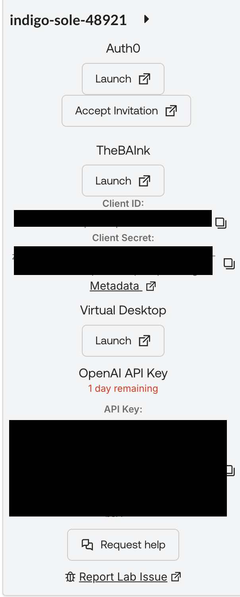

## Sign in to your Auth0 account
As part of the provisioning process for your Auth0 tenant, an Auth0 admin was created that corresponds to the email address that you used to sign in to this very platform (https://labs.demo.okta.com).

> [!IMPORTANT]
> Your Auth0 tenant will be available for *thirty (30) days* for exploration and development.

To activate your tenant, follow these instructions:

1. From the Launch Pad on the right of the screen, click on the Accept Invitation.

    

2. Follow the instructions to accept the invitation.

    

3. Upon successful acceptance of the invitation, you will land in your newly created Auth0 tenant.

    

## Navigating your Lab Guide
Before we get started, here is some information about the Labs.Demo.Okta platform you are using today.

### dev{camps} Outline
On the left of the screen, you will find an outline of today’s lab which also serves as your navigation control panel. This dev{camp} Agentic AI workshop consists of **six (6)** <mark>**modules**</mark>, each containing <mark>**tasks**</mark> with <mark>**steps**</mark>. You also have the ability to collapse the outline at any time by clicking on the arrow icon.

At the bottom of each section, there's a handy control to navigate forwards and backwards between the sections. You can also simply click on different sections (and subsections) to navigate freely.

### Launch Pad
On the right of the screen, you will find an easy way to launch your lab resources. Each resource has its own launch button along with the tenant names and credentials (where applicable).

### Dynamic Lab Guide Variables
In addition to the ability to copy credentials from the Launch Pad, we've also produced this lab guide using *dynamic variables*. Some variables (*not all*) will display values *specific* to your lab environment. For example, your tenant domain: `{{idp.tenantDomain}}`.

> [!NOTE]
> If you see what appears as though it *should* be a dynamic variable, you'll be able to tell by the curly braces: <kbd>{{...}}</kbd>.
>
> Technology isn't perfect! Chances are something went awry and the variable did not populate.

### Just a few things...

- This lab uses a combination of the Okta Demo Platform and a self-guided learning application (*powered by Aiya*). Feel free to switch between the two but keep in mind the content _may_ vary slightly. Also, remember that AI chatbots are *not* deterministic -- you never know what you'll get!

  When in doubt, this **Demo Platform** is [most likely] the more accurate source of truth.

- Throughout the lab you will see various types of alerts/panels like the following.

  They provide useful information. Take a minute to familiarize yourself with their intent so you know which ones you should _really_ pay attention to.  :)

  > [!NOTE]
  > Useful information that might help you.

  > [!Tip]
  > Helpful advice for doing things better or more easily.

  > [!Important]
  > Key information you may need to know to complete the lab.

  > [!Warning]
  > Urgent info that needs your immediate attention to avoid problems.

  > [!Caution]
  > Advises about risks or negative outcomes of certain actions.

 

**Phew!** 😮‍💨 *Now that all of that out of the way,* let's go!