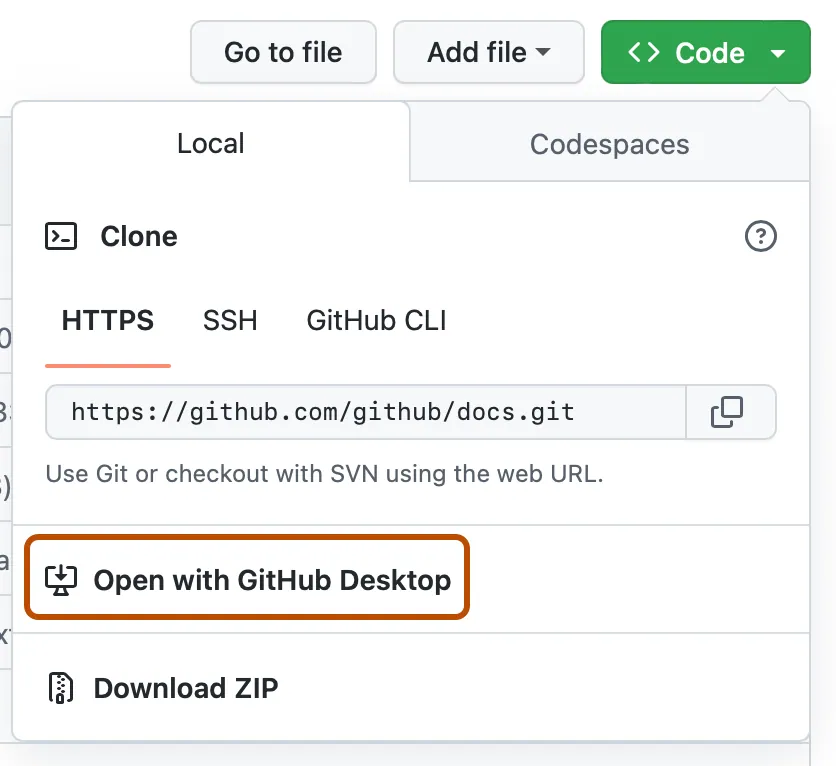

## Activate Auth0 Tenant

An Auth0 tenant has been created for you. In the top right corner of your screen, click the **Accept Invitation** button, or follow the activation instructions in the email you received from `no-reply@demo.okta.com` to the email address with which you registered.

Click on **Accept Invitation** and follow the steps. This will launch you into the Auth0 management dashboard.

You now have an Auth0 tenant for providing identity services for your applications. You will have access to this tenant for **30 days**.

### Verify lab bootstrap

* **Application**: a *Regular Web App* named `the bAInk` should have been created.
<!-- * **MFA (SMS)**: the tenant is configured to use `https://sms.atko.rocks` for the SMS gateway. -->

> [!TIP]
> If something is missing, don’t panic — Aiya can help you manually "re‑bootstrap" from inside the app.
>
> Or ask a lab attendant for assistance.

## Clone the Repo

> [!WARNING]
> _**You may need a Github account to continue.**_
>
> If you do not already have a Github account [*get one now*](https://github.com/signup?ref_cta=Sign+up&ref_loc=header+logged+out&ref_page=%2F&source=header-home).

You can clone the repo using the UI *or* via command line -- the choice is up to you.

> [!TIP]
> Need a refresher on cloning a repo? No worries. We [got you](https://docs.github.com/en/repositories/creating-and-managing-repositories/cloning-a-repository).
***TODO: REPO URL***
#### Command Line
```bash
git clone <REPO_URL>
cd <REPO_DIR>
```
> [!IMPORTANT]
> Remember to navigate (`cd`) to the directory where you have cloned the repo!

#### Desktop
*You will need to have Github Desktop installed*.
1. Navigate to the [repo](#).
2. From the main page click on the **<> Code** button.
   
3. Click on **Open with GithHub Desktop**
   
4. Follow the prompts in GitHub Desktop.

> [!NOTE]
> Refer to [GitHub's instructions](https://docs.github.com/en/repositories/creating-and-managing-repositories/cloning-a-repository?tool=desktop) for further details on cloning a repo using GitHub Desktop.

---
#### *Great! Let's continue to the get the app started up.*