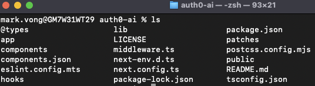
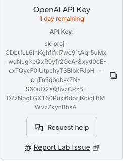
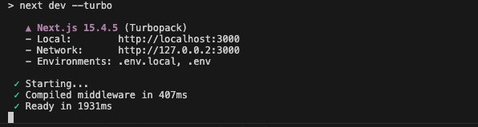

## Objective

1. Verify that a bootstrapped <mark>Regular Web Application</mark> has been created in your Auth0 tenant with the correct configuration details.
2. Successfully clone the project folder from the provided github repository.
3. Install all the project dependencies, generate the database, and successfully start the application *locally*.


## Description

As a recap, an Auth0 tenant was created for you when you initially started the lab. Make sure you can access the tenant and can see the management dashboard. Also important to note, you will have access to this tenant for *30 days*.

In this module, we will be cloning the bAInk’s demo project files from the provided github repo for local development. You will be meeting Aiya shortly!


## Task 1: Verify lab bootstrap
1. If you have not already, from the Launch Pad in the Lab Guide, launch into your Auth0 tenant.
2. From the Auth0 tenant dashboard, click on **Applications**.
3. From the list of Applications, click on **the bAInk** application.
4. From the application settings screen, confirm that the configuration settings match:
    - **Allowed Callback URLs**: ```http://localhost:3000/auth/callback```
    - **Allowed Logout URLs**: ```http://localhost:3000```
    - **Allowed Web Origins**: ```http://localhost:3000/auth/callback```

## Task 2: Clone the Repo
You can clone the repo using the UI or via command line. Need a [refresher](https://docs.github.com/en/repositories/creating-and-managing-repositories/cloning-a-repository) on cloning a repo?

### Command Line (easiest)

<br>

> [!CAUTION]
> If you do not have <kbd>git</kbd> installed on your machine, download and install it from [here](https://git-scm.com/downloads).

<br>

1. Clone the repo

    ```bash
    git clone https://github.com/udplabs/auth0-ai.git
    ```

2. Step into the project folder

    ```bash
    cd auth0-ai
    ```

3. Verify project files are present

    ```bash
    ls
    ```

    > [!NOTE]
    >
    > If you're on a windows machine and running **PowerShell**, run the following command instead:
    >```powershell
    > dir
    >```

    <br>

***You should see the following files:***




<details>
<summary><h4>Alternative Option: <i>Github Desktop</i></h4></summary>

> [!CAUTION]
> If you do not have Github Desktop installed, you will first need to [download and install](https://desktop.github.com/download/) it.

1. Navigate to the [repo](https://github.com/udplabs/auth0-ai).
2. From the main page click on the **<> Code** button.
   
3. Click on **Open with GithHub Desktop**
   
4. Follow the prompts in GitHub Desktop.

    > [!NOTE]
    > Refer to [GitHub's instructions](https://docs.github.com/en/repositories/creating-and-managing-repositories/cloning-a-repository?tool=desktop) for further details on cloning a repo using GitHub Desktop.

<br>
</details>

## Task 3: Add OpenAI API Key

For this lab we have generously provided you with an OpenAI API key. This key is **not** guaranteed to last! Although it shows an expiration date, be advised that we may need to expire it early (without warning).

*To get your own API key, follow OpenAI's guides/documentation.*

1. Navigate back to the Launch Pad in the Lab Guide and copy the OpenAI API Key

    

2. In your IDE, navigate to the <kbd>.env</kbd> file that is located in the **root** of the project folder (<kbd>./auth0-ai/.env</kbd>) and update it with the API key:

    <kbd>OPENAI_API_KEY="YOUR_API_KEY"</kbd>

    > [!TIP]
    >
    > The Vercel AI SDK supports numerous different providers. While we are using OpenAI for this lab you can technically use any provider.
    >
    > Just be advised that each provider has slight variations in behavior and/or requirements and may not be 100% compatible with the demo application.

3. ***Save the changes!***

<br>

---
> [!NOTE]
> For ease and simplicity the lab utilizes only one <kbd>.env</kbd> file.
>
> ***We do not recommend this in a production environment.***
>
> Best practice is to keep 'secrets' or sensitive information in <kbd>.env.local</kbd>.
>
> *Rule of thumb* -- **Follow best practice for your organization.**
>
> *Refer to [NextJS documentation](https://nextjs.org/docs/app/guides/environment-variables) for additional information on how variables are handled in NextJS specifically.*
---
<br>

## Task 3: Start the app
1. In your terminal or powershell, install the project dependencies using NPM

    ```bash
    npm install
    ```
2. After package install is completed, start up the application:

    ```bash
    npm start
    ```

    <br>

    > [!NOTE]
    > If the application started successfully, you should see something similar to the following:
    >
    > 
    >
    > *If you’re having trouble, please ask for some assistance from a lab attendant.*

<br>

### Open the app

<br>

> [!WARNING]
> The app may take a few seconds (*or minutes*) the first time to boot up as it *compiles*.
>
> This may be the case for *each* page/route the first time it loads. Please be patient! Pay attention to the console -- if it says "Compiling", it's *compiling*. 🙄

<br>

1. In a web browser (we ***strongly*** recommend Chrome for this lab), navigate to:

    [`http://localhost:3000`](http://localhost:3000)


If everything is working as expected, Aiya will kick off a conversation with you. Aiya will help guide you through the lab (for the most part) from this point forward.


#### <span style="font-variant: small-caps">Congrats! 🥳</span>
*You have completed this module.*

You have successfully:
<ul>
  <li style="list-style-type:'✅ ';">
    verified your Auth0 tenant's configuration;
  </li>
  <li style="list-style-type:'✅ '">
    cloned the lab project repository;
  </li>
  <li style="list-style-type:'✅ '">
    set up the initial portion of the application;
  <li style="list-style-type:'✅ '">
    get the app up and running on localhost;
  </li>
  <li style="list-style-type:'✅ '">
    <i><b>You met Aiya!***</b></i> 🤖 🥳
  </li>
</ul>


#### <span style="font-variant: small-caps">Let's keep moving.</span>