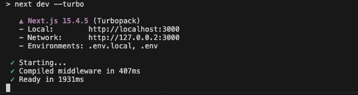
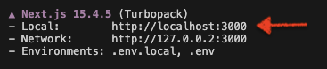

## Start the app

---
> [!CAUTION]
> <span style='color: red; font-variant: small-caps'>***This lab REQUIRES*** `pnpm`</span>!
>
> Due to needing to patch certain SDKs `pnpm` ***is a requirement***.
>
> ***You should have already installed `pnpm` specified in the Prerequisites section.***
>
> If you do not currently have `pnpm` installed, follow [installation guide](https://pnpm.io/installation) before continuing with the lab.
---

<br>

Now that the repo has been cloned, go ahead and open it in your **IDE**.

When ready, run the following in your terminal.
```bash
pnpm install
```

<br>

> [!CAUTION]
> If you receive a WARNING indicating that build scripts have been ignored, run `pnpm approve-builds` and approve *all* builds.
>
> Then run `pnpm install` *again*.
>
> If you still receive the WARNING, run `pnpm approve-builds` one more time followed by `pnpm install`. That should do the trick!

<br>

> [!TIP]
> Run into issues with `pnpm install`?
>
> Double check the following:
> 1. You are using Node v23
> 2. You have navigated (`cd`) into the repo root directory.

<br>

> [!NOTE]
> `pnpm` is pretty fast, but it might take a few minutes -- the network might be getting hammered!

<br>

Once complete, go ahead and run the following to generate the database:

```bash
pnpm db:generate
```

And then start up the app!
```bash
pnpm dev
```

This should start the app.

If you are seeing the following (*or something similar that says '**Ready**'*), you're ready to head to the next step!



If you're not... you might need to ask for assistance.

## Open the app

<br>

> [!IMPORTANT]
> The app might take ***30 - 60 seconds*** the first time it runs as it needs to compile.
>
> This may be the case for each page/route the first time it loads.
>
> *Please be patient!*

<br>

**Congrats!** You have spun up a basic chat app. Easy, right? 🤣

You should now be able to open up a web browser (we recommend Chrome) and navigate to `http://localhost:3000`.

<br>

> [!TIP]
> You can also simply press **⌘** + click the link in the terminal.
>
> 
>
> On a PC? 🤨 You know the drill... ***CTRL*** + click.

<br>

If everything is working as expected, Aiya will kick off a conversation with you. Aiya will help guide you through the lab (*for the most part*) from this point forward.


