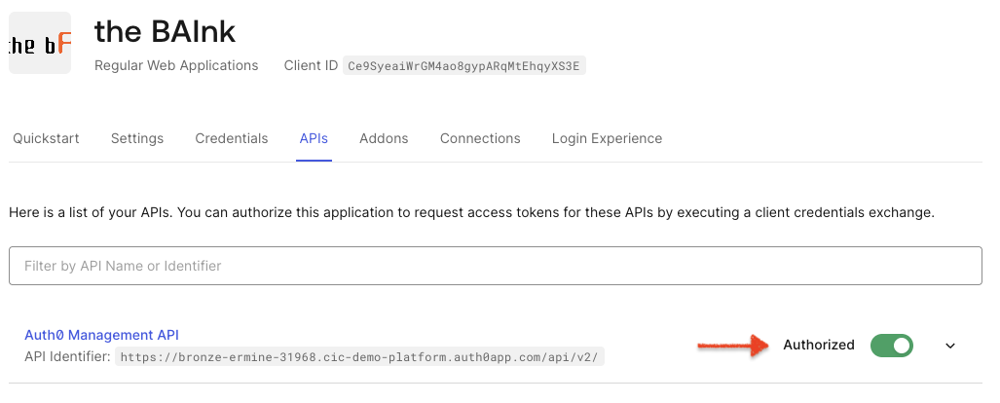
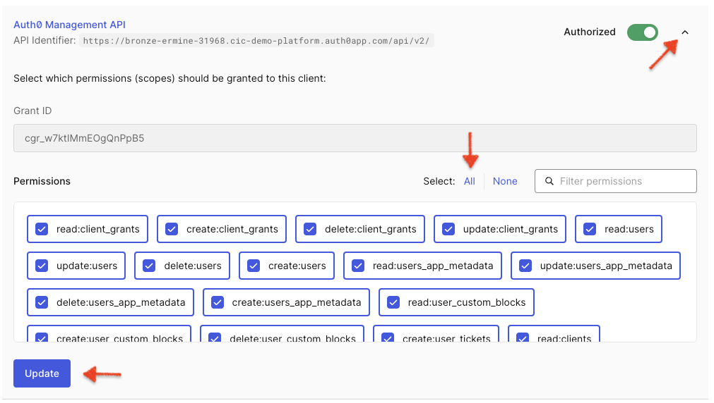
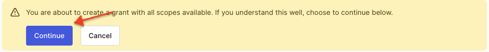
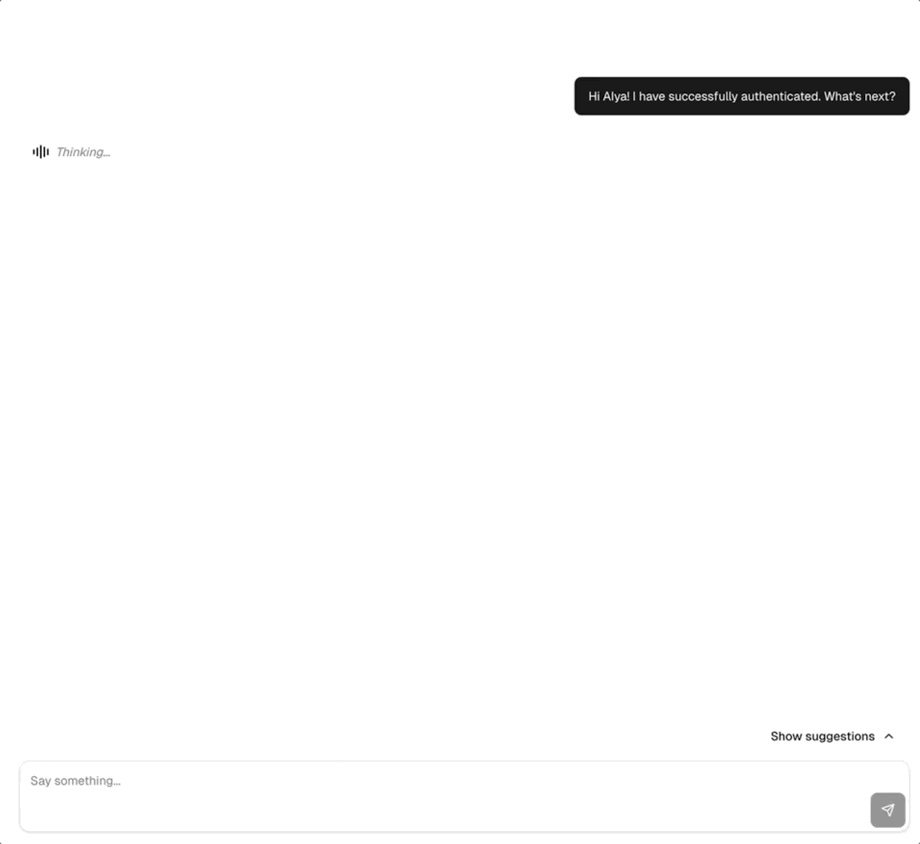

Now it’s time to wire up authentication so your app can actually log people in. Until this step is complete, Aiya is running in “training wheels” mode. Once you’re logged in, the fun (RAG + FGA) really begins. 🚀

## ✅ Expected Outcome

By the end of this step you should:

- Be able to sign up / log in via Auth0.
- Have a working session in your app.
- Trigger AIya’s “you’re authenticated!” message.
- Unlock the rest of the lab steps.
---

## Add Auth0 Tenant `.env` *server-side variables*

Navigate to the **root** project folder where you cloned the repo (`./auth0-ai`) and open the `.env` file.

> [!TIP]
> Notice the values below are prepopulated. 🎉
>
> You can click the clipboard to copy the following as-is and drop it in the `.env` file.

The following values are already in the `.env` file but *commented out*. Either update their values (and uncomment them) or simply add the following as-is:

```env
AUTH0_DOMAIN={{idp.tenantDomain}}
```
```env
AUTH0_CLIENT_ID={{TheBAInk.credentials.clientId}}
```
```env
AUTH0_CLIENT_SECRET={{TheBAInk.credentials.clientSecret}}
```
> [!IMPORTANT]
> **My values do not seem to be pre-populated. Where else can I find them?**
>
> If the values are ***not*** pre-populated above, follow the following steps:
> 1. Navigate to the [Auth0 Demo Platform Dashboard](https://manage.cic-demo-platform.auth0app.com/dashboard).
> 2. Select your tenant (the one created for this lab -- you probably already have it open!).
> 3. Go to **Applications → Applications → \[the bAInk]**.
> 4. Copy the **Domain**, **Client ID**, and **Client Secret**.

## Add Auth0/NextJS `.env` secret

Next, we need to generate a secret that the Auth0 NextJS SDK uses to encrypt the session and transaction cookies.

<br>

> [!CAUTION]
> ***You will need `openssl` to complete this step.***

<br>

1. In your terminal copy and run the following command:
    ```bash
    openssl rand -base64 32
    ```
2. Copy the resulting value and add it as the `AUTH0_SECRET` variable's value.
    ```env
    AUTH0_SECRET=<randomly-generated-value>
    ```
<br>

---
> [!NOTE]
> Windows PC user? No `openssl`? No worries!
>
> Check out this [cool tool](https://www.cryptool.org/en/cto/openssl/) and run `openssl rand -base64 32` in the on-screen terminal.
---
> [!NOTE]
> For ease and simplicity this lab utilizes only one `.env` file.
>
> ***We do not recommend this in a production environment.***
>
> Best practice is to keep 'secrets' or sensitive information in `.env.local`.
>
> *Rule of thumb* -- **Follow best practice for your organization.**
>
> *Refer to [NextJS documentation](https://nextjs.org/docs/app/guides/environment-variables) for additional information on how variables are handled in NextJS specifically.*
---

<br>

## Save & Restart

Just to be safe, restart your dev server so it picks up the new environment variables:

1. Terminate the app:
<br>`^` + `C` (Mac)
<br> *or*
<br>`Ctrl` + `C` (PC)

2. Start the app again. *If the app does not auto-refresh, make sure to manually refresh it.*
    ```bash
    pnpm dev
    ```

## Enable Management API
This application utilizes the management API to fetch/update profile information as well as manage authenticators for MFA.

Before it can be used, it needs to be enabled.

1. Return to the Auth0 Admin Dashboard
2. Navigate to **Applications** → **the bAInk** → **APIs**.
3. On the **Auth0 Management API** enable **Authorized**.
   
4. Click the arrow next to the toggle to expand the menu.
5. Click to select **All**.
6. Click **Update**
   
7. On the warning that appears, click **Continue**
   

    <br>

    > [!WARNING]
    > In a production environment, we encourage a least-privilege approach -- *only grant the scopes you know you need*.
    >
    > Even better, do not call the management API directly with a user token -- use a M2M token scoped to the specific service (i.e. your `/user` API).

    <br>

*Great! Now you should be ready to test.* 🥳

<br>

## Test authentication

1. Return to the open app **or** reopen the app at [`http://localhost:3000`](http://localhost:3000).
2. Click **Sign up**.

   > [!NOTE]
   > If you do not see **Sign up** you can always access sign up from **Log In** as well.

   > [!TIP]
   > For an even faster experience, try using **Continue with Google**.

3. **Create a user.** Use any email you want but we recommend you actually have access to it.
4. **Pick a password.** *I know*... passwords are so last year. *That's another lab for another day*.

*If everything is working:*

* You will be redirected back to the app as an authenticated user.
* A message will be sent (*automatically*) to Aiya that you have *successfully authenticated*.
* From here, accounts + transactions are automatically created for you behind the scenes. 🎉
  * Feel free to click on **Accounts** if you don't believe me!



> [!TIP]
> If the above did **not** work:
>
> * Check your `.env` for typos and verify against your Auth0 tenant.
> * Open the browser console and/or server logs to check for error details.
> * Ask Aiya -- e.g. `I’m failing auth with error XYZ` (*and paste the error message*).