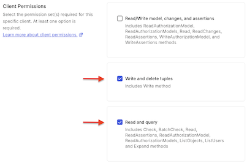
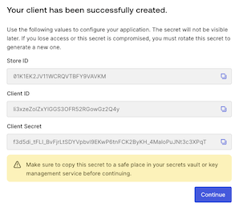
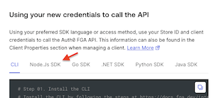
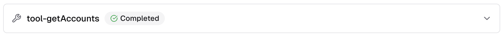
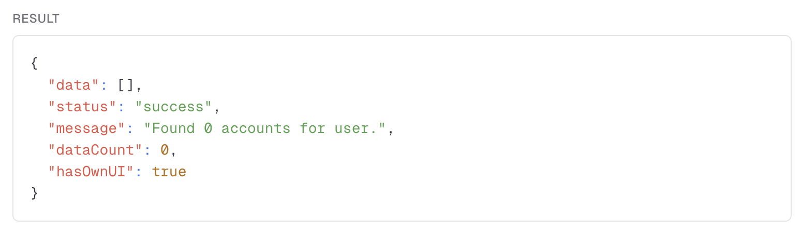

k## ✅ Expected Outcome for this step
- A general understanding of what Retrieval Augmented Generation is (and is not).
- Have created an <abbr title='Fine-Grained Authorization'>FGA</abbr> store and populated a model.
- Configured your application to use <abbr title='Fine-Grained Authorization'>FGA</abbr>.

*Let's get started!*

---

Authorization for Retrieval-Augmented Generation (RAG) ensures that when a GenAI application retrieves and uses data external to its model it only accesses information that the specific user is permitted to see. This prevents the AI model from inadvertently [exposing sensitive or confidential data](https://genai.owasp.org/llmrisk/llm022025-sensitive-information-disclosure/) to unauthorized individuals.

<br>

> [!NOTE]
> ### What *is* <abbr title='Retrieval-Augmented Generation'>RAG</abbr>?
>
> That's a great question! The more important question though is, "What _isn't_ <abbr title='Retrieval-Augmented Generation'>RAG</abbr>?" 🤔
>
> #### What it **IS**:
>
> Retrieval-Augmented Generation is a framework where a generative model (such as GPT-5) is augmented with an external retrieval mechanism.
>
> The process involves two main steps:
> 1. **Retrieval**: The system fetches relevant documents or data from an external source (knowledge base, database, file system, etc.) based on the user’s query.
> 2. **Generation**: The generative model uses both the retrieved information and the original query to generate a response.
>
> ##### But _why_?
>
> <abbr title='Retrieval-Augmented Generation'>RAG</abbr> helps LLMs answer questions with information that may not be present in their training data, enabling up-to-date and domain-specific responses.
>
> #### What it **is NOT**:
>
> ***Not just for vector databases.*** While vector databases (for semantic search) are commonly used for retrieval, <abbr title='Retrieval-Augmented Generation'>RAG</abbr> is not limited to them.
>
> Retrieval can be done using:
> - Traditional keyword search
> - SQL queries
> - API calls
> - File lookups
> - *Any mechanism that fetches relevant context for the model*.
>
> **Not *only* for Q&A/KB use cases.** <abbr title='Retrieval-Augmented Generation'>RAG</abbr> is not just for question answering. It can be used for summarization, document generation, chatbots, code generation, and more -- any scenario where external knowledge improves output.
>
> **Not an LLM model architecture.** <abbr title='Retrieval-Augmented Generation'>RAG</abbr> is a *system-level pattern*, not a specific neural network *architecture*. It describes how *retrieval and generation* are orchestrated, not how the model itself is *built*.
>
> #### Takeaway
> - <abbr title='Retrieval-Augmented Generation'>RAG</abbr> is a **pattern**, not a product or single tool.
> - Retrieval can use **any method** to fetch relevant data, not just vector (semantic) search.
> - Augmentation means the model's output is *improved* by grounding it in external often dynamic, information.
> - Generation is performed by an LLM, which uses both the query and the retrieved context.

<br>

## The challenge: Securing data in <abbr title='Retrieval-Augmented Generation'>RAG</abbr> pipelines

Retrieval-Augmented Generation (RAG) is a powerful technique that enhances Large Language Models (LLMs) by providing them with relevant, up-to-date information from external data sources, such as a company's internal knowledge base, document repository, or even account and transactional data (like in our app).

However, without proper access controls, a <abbr title='Retrieval-Augmented Generation'>RAG</abbr> pipeline could retrieve information containing sensitive information (e.g., financial reports, HR documents, strategic plans, transactional data) and use them to generate a response for a user who should not have access to that data.

This could lead to *serious* data breaches and compliance violations. Simply filtering based on user roles alone is often insufficient for managing the complex, relationship-based permissions found in real-world applications.

<br>

> [!IMPORTANT]
> For our dev{camp} we are *over simplifying* the authorization model for accounts and transactions for the sake of learning.
>
> In a real world situation, you can imagine how complex account access can get -- think of financial advisors, family accounts, even third-party aggregation software (i.e. Mint, Copilot, Lunchmoney, etc. ).

<br>

> [!NOTE]
> #### Let's talk about *documents*...
>
> With <abbr title='Retrieval-Augmented Generation'>RAG</abbr> you will hear the term "documents" used a lot. It's a fancy word for a simple concept. It's also overused (and sometimes misused).
>
> A "document" is simply data stored in a database. As it pertains to <abbr title='Retrieval-Augmented Generation'>RAG</abbr>, that *tends* to be a vector store.
>
> When it comes to Agentic AI, <abbr title='Retrieval-Augmented Generation'>RAG</abbr> is often conflated with *semantic search* (in vector stores). But, remember, the reality is that <abbr title='Retrieval-Augmented Generation'>RAG</abbr> is _**any augmentation of AI by means of retrieval**_!
>
> Fetching accounts? <span style="color: orange; font-variant: small-caps; padding-left: 10px">Rag</span>
>
> Fetching user preferences? <span style="color: orange; font-variant: small-caps; padding-left: 10px">Rag</span>
>
> Fetching "documents" from a knowledge base? You guessed it...<span style="color: orange; font-variant: small-caps; padding-left: 10px">Rag</span>
>
> But only *one* of those use cases would likely benefit from using a vector store. (*The last one in case you were wondering.*)

<br>

> [!TIP]
> Want to learn more? Ask Aiya to dive deep and explain.

<br>

## The solution: *Auth0 Fine-Grained Authorization (FGA)*

To solve this challenge, Auth for GenAI uses [**Auth0 Fine-Grained Authorization (FGA)**](https://auth0.com/fine-grained-authorization). Auth0 <abbr title='Fine-Grained Authorization'>FGA</abbr> is a flexible, high-performance authorization service for applications that require a sophisticated permissions system. It implements Relationship-Based Access Control (ReBAC) to manage permissions at large-scale. Auth0 <abbr title='Fine-Grained Authorization'>FGA</abbr> is built on top of [OpenFGA](https://openfga.dev/), created by Auth0, which is a [CNCF](https://cncf.io/) sandbox project.

Auth0 <abbr title='Fine-Grained Authorization'>FGA</abbr> allows you to decouple your authorization logic from your application code. Instead of embedding complex permission rules directly into your application, you define an authorization model and store relationship data in Auth0 <abbr title='Fine-Grained Authorization'>FGA</abbr>. Your application can then query Auth0 <abbr title='Fine-Grained Authorization'>FGA</abbr> at runtime to make real-time access decisions.

## How it works with <abbr title='Retrieval-Augmented Generation'>RAG</abbr>

Integrating Auth0 <abbr title='Fine-Grained Authorization'>FGA</abbr> into your <abbr title='Retrieval-Augmented Generation'>RAG</abbr> pipeline ensures that every "document" is checked against the user's permissions before it's passed to the LLM (or presented to the user).

The process works as follows:

1. <span style='padding-right: 10px; font-variant: small-caps; font-weight: 700'>Authorization Model</span> First, you define your authorization model in Auth0 <abbr title='Fine-Grained Authorization'>FGA</abbr>. This model
specifies the types of objects (e.g., <kbd>document</kbd>), the possible
relationships between users and objects (e.g., <kbd>owner</kbd>, <kbd>editor</kbd>, <kbd>viewer</kbd>),
and the rules that govern access.

    > [!NOTE]
    > For our model we are working with <kbd>accounts</kbd>, <kbd>owners</kbd>, <kbd>delegates</kbd>, and <kbd>agents</kbd>.

2. <span style='padding-right: 10px; font-variant: small-caps; font-weight: 700'>Store Relationships</span> You store permissions as '*tuples*' in Auth0 <abbr title='Fine-Grained Authorization'>FGA</abbr>. A tuple is the core data
element, representing a specific relationship in the format of <kbd>(user, relation, object)</kbd>. For example, <kbd>user:anne</kbd> is an <kbd>owner</kbd> of
<kbd>account:12345</kbd>.

    <br>

    > [!TIP]
    > In the **US** most people say tuples (/ˈtuːpəl/) like [**too•plz**](https://ssl.gstatic.com/dictionary/static/pronunciation/2024-04-19/audio/tu/tuples_en_us_2.mp3).
    >
    > In the **UK**, most people say tuples (/ˈtjuːpəl/) [**tuh•plz**](https://dictionary.cambridge.org/media/english/uk_pron/c/cdo/cdo02/cdo0216tupluk2149.mp3)

    <br>

1. <span style='padding-right: 10px; font-variant: small-caps; font-weight: 700'>Fetch & Filter</span> When a user submits a query to your GenAI application, your backend first
fetches relevant documents from a vector database and then makes a
permission check call to Auth0 <abbr title='Fine-Grained Authorization'>FGA</abbr>. This call asks, "Is this user allowed to
view these documents?". Our AI framework SDKs abstract this and make it as
easy as plugging in a filter in your retriever tool.

    > [!NOTE]
    > For our implementation we are determining the account access available to a user/agent.

1. <span style='padding-right: 10px; font-variant: small-caps; font-weight: 700'>Secure Retrieval</span>Auth0 <abbr title='Fine-Grained Authorization'>FGA</abbr> determines if the user is authorized to access the documents. Your
application backend uses this data to filter the results from the vector
database and only sends the authorized documents to the LLM.

## Set up an <abbr title='Fine-Grained Authorization'>FGA</abbr> Store

<br>

> [!WARNING]
> At the moment we have yet to link our Demo Platform and Auth0 <abbr title='Fine-Grained Authorization'>FGA</abbr> <abbr title='single sign-on'>SSO</abbr> (*the irony* 🙄) so you will need to use a separate Auth0 account.
>
> If you already have one, use it. Otherwise, create a new one -- it's free!

<br>

1. [Sign Up](https://dashboard.fga.dev/) for an Auth0 <abbr title='Fine-Grained Authorization'>FGA</abbr> account.
2. Go ahead and navigate to **Model Explorer** and paste the following into the model dialog:

    TODO: Explain this

    ```bash
    model
    schema 1.1

    type user

    type agent

    type account
      relations

        # === Subjects (you write tuples on these) ===
        # Owners must be humans
        define owner: [user]
        # Either a human OR an agent
        define delegate: [user, agent]
        # ============================================

        # Base viewing right implied by delegation (no tuples here)
        define view_account: owner or delegate

        # === Grantable capabilities (to specific people/agents) ===
        # A basic capability flag (“this person may transfer on this account”), independent of amount.
        define transfer_funds: [user, agent]

        # Balance visibility is opt-in per user (or implicit for owners).
        define view_balances: [user, agent]
        # Transaction visibility requires both (a) being a delegate (base view) and (b) a specific grant to see transactions.
        define view_transactions: [user, agent]

        # Policy gate(s) with conditions: attach as role defaults:
        define transfer_limit_policy: [
          account#delegate with transfer_limit_policy,
          account#owner with transfer_limit_policy
        ]

        # ===== Derived checks (what your app asks for) =====
        # owners always can view
        # delegates get view via can_view
        define can_view: owner or view_account

        # owners can always view
        # delegates get view via view_account & view_balances
        define can_view_balances: owner or (view_account and view_balances)

        # owners can always view
        # delegates get view via view_account & view_balances
        define can_view_transactions: owner or (view_account and view_transactions)

        # Basic "show the transfer button" permission
        # owners can always view
        # delegates get view via view_account & view_balances
        define can_transfer: owner or (view_account and transfer_funds)

        # Enforce both visibility + capability + policy for an actual transfer
        # Nothing is implicit -- even owners need explicit permission
        define can_transfer_funds: (view_account and transfer_funds and transfer_limit_policy)
        # ============================================

    # transaction_amount is supplied at check time (from the request).
    # transaction_limit is typically stored on a tuple (or could also be supplied contextually for coarse, account-wide rules).
    condition transfer_limit_policy(transaction_amount: double, transaction_limit: double) {
    transaction_amount <= transaction_limit
    }
    ```

    <br>

    > [!IMPORTANT]
    > Remember to click **Save**!

    <br>

3. Navigate to **Settings**. In the **Authorized Clients** section, click **+ Create Client**.
   
4. Give your client a name It can be whatever you want but maybe something like:

    ```
    the-bAInk
    ```
5. Select **Write and delete tuples** and **Read and query**.
    

    <br>

    > [!IMPORTANT]
    > In normal production development we always advise least privilege access -- if your client does not *need* all the permissions, don't grant them!

    <br>

6. Click **Create**.
7. See the following? *Success*! 🙌

    

8. ***Before*** clicking **Continue** on the dialog, grab the **Store ID**, **Client ID**, and **Client Secret** and update the following section of your <kbd>.env</kbd> file:

    ```env
    # ==================== OpenFGA ====================
    # Store ID from fga.dev
    FGA_STORE_ID=
    # Client ID from fga.dev
    FGA_CLIENT_ID=

    # Normally secrets should go in .env.local, but for the sake of the lab
    # we are including them here so you only have one file to edit.
    # Client Secret from fga.dev
    FGA_CLIENT_SECRET=
    # =================================================
    ```

    <br>

    > [!TIP]
    > ***After*** clicking continue in the dialog, you will see guidance on using your new credentials.
    >
    > *Keep this dialog open for now* and refrain from selecting **Done**.
    >
    > You *might* want to refer back to this tab in the next lab section. 😉
    > 

    <br>

9.  Restart the application (*just to be certain everything sticks*).

    <br>

    > [!NOTE]
    > Normally a full restart of the application is unnecessary -- NextJS should hot reload when <kbd>.env</kbd> changes.
    >
    > It is generally a *better* practice to restart the application.
---

*Great job! Let's test out our work.*

---

#### Return to the application and send a message to Aiya:
```
Show me my account summary.
```

#### No results? 🥺

If you get something like this:



and when expanded there are no results...



#### *Then it worked!* Congrats!

I know, you were expecting actual results, but this is a good thing. It means you are not seeing account data you do not have permission to view!

Head to the next step so we can work on wiring up <abbr title='Fine-Grained Authorization'>FGA</abbr> to manage our account and transaction permissions.