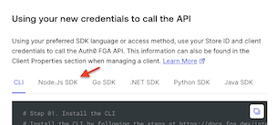

## Objective

Integrate a functioning FGA client into the demo application. This will enable you to verify that Aiya can correctly return sensitive account information with valid results.


## Description

As a customer of The bAInk, it is expected that you should be able to see your own account information, assuming you have already been successfully authenticated into the application. After logging into the bAInk web portal and asking Aiya for your account information, you should be able to see the relevant and valid information being returned.

---
At this point we are moving into actual code. This module is designed to encourage you to write your own code rather than copy/paste.

However, if you would prefer a copy/paste approach, you can click the suggestion above the chat input box `Show me the code` and Aiya will provide the final code for you to reference.

You can simply type <kbd>Show me the code for step XX</kbd>.


***We encourage you to try on your own first.***

---

## Task 1: Add FGA Client

#### Expected Outcome
*In this section we will expand the existing code found in* <kbd>lib/auth0/fga/client.ts</kbd> to enable a fully functioning <abbr title='Fine-Grained Authorization'>FGA</abbr> client.

You will notice much of the code has *already been written* for you, but there is a lot missing!

<span style="font-variant: small-caps; font-weight: 700">Setup</span>

- Open <kbd>lib/auth0/fga/client.ts</kbd> in your code editor


<span style="font-variant: small-caps; font-weight: 700">Steps</span>

1. ~~Install <kbd>@openfga/sdk</kbd>~~. _<span style='color: green; font-variant: small-caps'>← already done</span>_
2. ~~*Define a (mutable) module‑level singleton reference*.~~ _<span style='color: green; font-variant: small-caps'>← Done for you</span>_

3. *Create (internal) FGA client.*
      - You will need to pull in the <kbd>.env</kbd> variables you setup previously and initialize a *new* instance of `OpenFgaClient`.
      - You will need, at a minimum, the following options:
        ```ts
        {
          apiUrl: process.env.FGA_API_URL,
          storeId: '',
          credentials: {
            method: CredentialsMethod.ClientCredentials,
            config: {
              apiTokenIssuer: '',
              apiAudience: '',
              clientId: '',
              clientSecret: ''
            }
          }
        }
        ```

        <br>

          > [!TIP]
          > Remember this screen from the previous section? Now might be a good time to go back and check it out!
          >
          > 
          >
          > Closed the dialog? Not sure how to get back? 😫
          >
          > ***Check out the [FGA Docs](https://docs.fga.dev/integration/setup-sdk-client) for guidance** (or ask Aiya!)*.

          <br>
4. ~~*Export a public getter*~~. _<span style='color: green; font-variant: small-caps'>← Done for you</span>_

<br>

You should now see <kbd>Success! FGA client initialized</kbd> in the console. If so, then great job! 👏 🎉 🌮

If not... check in with Aiya (*or a lab attendant*) to see where things may have gone awry.

You *may* need to **refresh the app**.

<br>

> [!CAUTION]
>
> Seeing an error like the following?
>
> 
>
> That just means you need to keep moving forward in the lab to finish implementing <abbr title='Fine-Grained Authorization'>FGA</abbr>.
>
> *Onward!*

## Task 2: Add <kbd>getAccountPermissions</kbd> Tool

#### Expected Outcomes
In this file you will complete the code necessary to:
  - actually call <abbr title='Fine-Grained Authorization'>FGA</abbr>;
  - check what the user is permitted to do;
  - adjust the API response based on the permissions <abbr title='Fine-Grained Authorization'>FGA</abbr> returned.

<span style="font-variant: small-caps; font-weight: 700">Setup</span>

- Open `lib/auth0/fga/get-account-permissions.ts` in your code editor.

Again, you will notice some of the code has *already been written* for you, but there is a lot missing!

<span style="font-variant: small-caps; font-weight: 700">Steps</span>

1. ~~*Guard for non-initialized client*.~~ _<span style='color: green; font-variant: small-caps'>← Done for you</span>_


2. *Define the relations to check for*.
    ```typescript
    [
      "can_view",
      "can_view_balances",
      "can_view_transactions",
      "can_transfer"
    ]
    ```

    <br>

    > [!TIP]
    > If you want to see how things work in the client, try leaving one or two permissions out and see what happens!
    >

    <br>

3. *Build the <abbr title='Fine-Grained Authorization'>FGA</abbr> batch checks*.
    - In this step you will build an array of checks to send to <abbr title='Fine-Grained Authorization'>FGA</abbr> *in batch*.
    - Think of it as asking <abbr title='Fine-Grained Authorization'>FGA</abbr> <kbd>Does user:\<customerId> have \<relation> on account:\<id></kbd>? *You just need to ask in a way <abbr title='Fine-Grained Authorization'>FGA</abbr> understands!*

4. ~~*Make a batch request to FGA via the client SDK*.~~ _<span style='color: green; font-variant: small-caps'>← Done for you</span>_

    <br>

    > [!TIP]
    > Use typescript errors to your advantage! You should be getting one here that will provide a hint on how to complete the previous step.

    <br>

5. ~~*Build/collect allowed relations per account id*.~~ _<span style='color: green; font-variant: small-caps'>← Done for you</span>_
    - This step is simply parsing the response into a usable array we can reference to build the account response.

6. *Build the final accounts response*

    Don't overthink this one! It seems complicated but it is simple:
      - *What permissions did <abbr title='Fine-Grained Authorization'>FGA</abbr> return for this account?*
      - *How should the response be modified, if at all, to adjust for what <abbr title='Fine-Grained Authorization'>FGA</abbr> returned?*
      - *Return the account data.*

7. ~~*Return the modified response*.~~ _<span style='color: green; font-variant: small-caps'>← Done for you</span>_

<br>

> [!TIP]
> In addition to asking Aiya for your account information you can also click on `Accounts` in the sidebar to do things _the old fashion way_. 🙄
>
> 

<br>

## Pulse Check
*Have you been able to successfully fetch account data?* 😬

#### _That's ok!_ Everything is working *exactly how it should be -- you should not be seeing accounts.*


***We need tuples!***

<br>

> [!NOTE]
> Not sure what '*tuples*' are? Check out Auth0's [FGA documentation](https://docs.fga.dev/fga-concepts#what-is-a-relationship-tuple) *or ask Aiya.*

<br>

<span style="font-variant: small-caps; font-weight: 700">Why didn't it work?</span>

In this module, we are simulating ***non-real-world situations***. *Normally* when an account is *initially created* (*or permissions modified in other ways*) the permissions would be set as tuples in <abbr title='Fine-Grained Authorization'>FGA</abbr>.

***Because your account data was auto-generated, you don't have any permissions!***

But don't worry, to save time, we've created a shortcut for you.

## Task 3: Reset Account Permissions

1. Open the 'dev tools' menu (*right-side of app*) and click on **Reset Account Permissions*.


🥁 ***drum roll please...*** 🥁 🎉 **Accounts!** 🎉

<sup>(*you might need to refresh the page*)</sup>

<br>

> [!TIP]
> If you are successfully seeing account information, but it is not *complete* (*see the following image*) then you *may not be checking for permissions correctly*.
>
> At least you get to preview what it looks like when <kbd>can_view_balances</kbd> is not granted! :D
>
> 

<br>

---
> [!IMPORTANT]
> *Remember...*
>
> This module is designed to encourage you to *write your own code* rather than copy/paste.
>
> However, if you would prefer a copy/paste approach you can click the suggestion above the chat input box <kbd>Show me the code</kbd> and Aiya will provide **the final code** for you to reference.
>
> You can also simply type <kbd>Show me the code for step XX</kbd>.
>
> 
>
> ***We encourage you to try on your own first.***

#### <span style="font-variant: small-caps">Congrats! 🥳</span>
*You have completed this module.*

You have successfully:
<ul>
  <li style="list-style-type:'✅ ';">
    installed and initialized the Auth0 FGA client;
  </li>
  <li style="list-style-type:'✅ '">
    implemented permission retrieval;
  </li>
  <li style="list-style-type:'✅ '">
    seeded relationship tuples via Dev Tools into FGA;
  </li>
  <li style="list-style-type:'✅ '">
    verified behavior when specific permissions are missing;
  </li>
  <li style="list-style-type:'✅ '">
    confirmed that no data is returned until valid tuples exist.
  </li>
</ul>