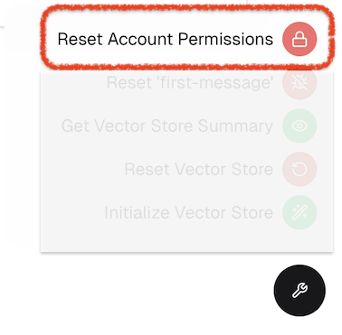

 ## ✅ Expected Outcome for this step
- A functioning FGA client in your app.
- A working function to generate/check account permissions.
- Accounts with appropriate tuples.
- *You should be able to ask Aiya for your account information and actually see results*.

*Let's get started!*

---
> [!TIP]
> This section implements the OpenFGA SDK client.
>
> For further details on the what/why on using the SDK, refer to the [SDK documentation](https://openfga.dev/docs/getting-started) directly.

---

## Add FGA Client
#### Expected Outcome
*In this section we will expand the existing code found in* `lib/auth0/fga/client.ts` to enable a fully functioning FGA client.

---
> [!IMPORTANT]
> *At this point we are moving into actual code.* 🙌
>
> This lab is designed to encourage you to *write your own code* rather than copy/paste.
>
> However, if you would prefer a copy/paste approach you can click the suggestion above the chat input box `Show me the code` and Aiya will provide **the final code** for you to reference.
>
> You can also simply type `Show me the code for step XX`.
>
> 
>
> ***We encourage you to try on your own first.***

---

*Normally*, if you are following [the SDK instructions](https://openfga.dev/docs/getting-started/install-sdk), you would need to add the OpenFGA package. *However, you already did* when you first ran `pnpm install`.

##### STEP 0
- [x] ~~Install `@openfga/sdk`~~

Awesome, right? Let's keep moving.


#### Open `lib/auth0/fga/client.ts`.

You will notice some of the code has *already been written* for you, but there is a lot missing! Let's quickly review what you'll need to do:

##### STEP 1
- [x] ~~*Define a (mutable) module‑level singleton reference*.~~ _<span style='color: green; font-variant: small-caps'>← Done for you</span>_

##### STEP 2
- [ ] *Create (internal) FGA client.*
- You will need to pull in the `.env` variables you setup previously and initialize a *new* instance of `OpenFgaClient`.
- You will need, at a minimum, the following options:
  ```ts
  {
    apiUrl: '',
    storeId: '',
    credentials: {
      method: CredentialsMethod.ClientCredentials,
      config: {
        apiTokenIssuer: '',
        apiAudience: '',
        clientId: '',
        clientSecret: ''
      }
    }
  }
  ```
##### STEP 3
- [x] ~~*Export a public getter*~~. _<span style='color: green; font-variant: small-caps'>← Done for you</span>_
You will notice some of the code has *already been written* for you, but there is a lot missing! Let's quickly review what you'll need to do:

> [!TIP]
> If you need some assistance or are not sure what to write, go ahead and ask Aiya for a hint or help.

---
> [!IMPORTANT]
> If, at this point, you see `Success! FGA client initialized` in the console then great job! 👏 🎉 🌮
>
> If not... check in with Aiya (*or a lab attendant*) to see where things may have gone awry.

Now we are going to move on to `lib/auth0/fga/get-account-permissions.ts`.

---
## Add getAccountPermissions


#### Expected Outcomes
In this file you will complete the code necessary to:

1. actually call FGA;
2. check what the user is permitted to do;
3. adjust the API response based on the permissions FGA returned.

##### STEP 1
- [x] ~~*Guard for non-initialized client*.~~ _<span style='color: green; font-variant: small-caps'>← Done for you</span>_

##### STEP 2
- [ ] *Define the relations to check for*.
  ```typescript
  [
   "can_view",
   "can_view_balances",
   "can_view_transactions",
   "can_transfer"
  ]
  ```
  > [!TIP]
  > If you want to see how things work in the client, try leaving one or two permissions out and see what happens!
  >

##### STEP 3
- [ ] *Build the FGA batch checks*.
- In this step you will build an array of checks to send to FGA *in batch*.
- Think of it as asking `Does user:<customerId> have <relation> on account:<id>`?

##### STEP 4
- [x] ~~*Make a batch request to FGA via the client SDK*.~~ _<span style='color: green; font-variant: small-caps'>← Done for you</span>_
  > [!TIP]
  > Use typescript errors to your advantage! You should be getting one here that will provide a hint on how to complete the previous step.

##### STEP 5
- [x] ~~*Build/collect allowed relations per account id*.~~ _<span style='color: green; font-variant: small-caps'>← Done for you</span>_
- This step is simply parsing the response into a usable array we can reference to build the account response.

##### STEP 6
- [ ] *Build the final accounts response*

  Don't overthink this one! It seems complicated but it is simple:
1. *What did FGA return for this account?*
2. *How should the response be modified to adjust for what FGA returned?*
3. *Return the account data.*

##### STEP 7
- [x] ~~*Return the modified response*.~~ _<span style='color: green; font-variant: small-caps'>← Done for you</span>_

---
> [!TIP]
> In addition to asking Aiya for your account information you can also click on `Accounts` in the sidebar to do things _the old fashion way_. 🙄
>
> 
---

## Pulse Check
*Have you been able to successfully fetch account data?* 😬

#### _That's ok!_ Everything is working *exactly how it should be.*


***We need tuples!***

> [!NOTE]
> Not sure what '*tuples*' are? Check out Auth0's [FGA documentation](https://docs.fga.dev/fga-concepts#what-is-a-relationship-tuple) *or ask Aiya.*

In the lab, we are simulating ***non-real-world situations***. *Normally* when an account is *initially created* (*or permissions modified in other ways*) the permissions would be set as tuples in FGA.

***Because your account data was auto-generated, you don't have any permissions!***

But don't worry, to save time, we've created a shortcut for you.

- [ ] Open the 'dev tools' menu (*right-side of app*) and click on **Reset Account Permissions*.



🥁 ***drum roll please...*** 🥁 🎉 Accounts! 🎉

<sup>(*you might need to refresh the page*)</sup>

> [!TIP]
> If you are successfully seeing account information, but it is not *complete* (*see the following image*) then you *may not be checking for permissions correctly*.
>
> At least you get to preview what it looks like when `can_view_balances` is not granted! :D
>
> 

---
> [!IMPORTANT]
> *Remember...*
>
> This lab is designed to encourage you to *write your own code* rather than copy/paste.
>
> However, if you would prefer a copy/paste approach you can click the suggestion above the chat input box `Show me the code` and Aiya will provide **the final code** for you to reference.
>
> You can also simply type `Show me the code for step XX`.
>
> 
>
> ***We encourage you to try on your own first.***

---
## Recap

### In this step you:
- [x] Installed and initialized the OpenFGA (Auth0 FGA) client.
- [x] Implemented permission retrieval (`getAccountPermissions`) to check: `can_view`, `can_view_balances`, `can_view_transactions`, `can_transfer`.
  - [x] Attached those permissions to the account API response so both the UI and Aiya can respect them.
- [x] Seeded relationship tuples via the Dev Tools shortcut (Reset Account Permissions).
- [x] Verified behavior when specific permissions are missing (e.g. balances or transactions hidden).
- [x] Confirmed that no data is returned until valid tuples exist (_secure by default_).

### Quick self‑check:
- Do you see account rows after seeding tuples?
- Does hiding one permission (e.g. omit `can_view_balances`) remove only that portion of the UI / AI response?
- Does Aiya refrain from *hallucinating* missing data?

### Key takeaway
- Fine-Grained Authorization sits *directly* in the RAG augmentation layer.
- Retrieval of account data is itself “RAG,” even though no vector database was involved.
- You grounded the AI (*and UI*) in only what the user is permitted to view -- no leaking data!

### Next up
You’ll build on these permissions to enforce more nuanced capabilities (e.g. transfers, transaction visibility) and now have the know-how to apply the same pattern to *other* retrieval tools -- let your imagination run wild!

### Proceed when:
✅ FGA client logs “Success”

✅ Accounts appear after reset

✅ Permission toggles behave as expected

*If any item is failing, revisit:*
- Environment variables
- Client initialization
- The specific FGA check calls you implemented
- Tuple seeding

> [!TIP]
> Don't forget, you can always ask Aiya for help!

### *Onward to the next step!*