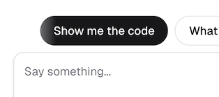

### <abbr title='Fine-Grained Authorization'>FGA</abbr>, <abbr title='Retrieval-Augmented Generation'>RAG</abbr>, & <abbr title='Client Initiated Backchannel Authentication'>CIBA</abbr>... oh my!

This guide attempts to mirror the Google codelab style: short steps, runnable code, and clear outcomes.

You’ll build a demo app for ***the bAInk*** using Next.js (App Router) that showcases **Auth0 Auth for AI Agents** as well as **Auth0 <abbr title='Fine-Grained Authorization'>FGA</abbr>** powering **<abbr title='Retrieval-Augmented Generation'>RAG</abbr>** and **securing AI tools**. Your companion AI assistant **Aiya** will be available inside the app (once you get it spun up) to help you out.

### Just a few things...

- This lab uses a combination of the Okta Demo Platform and a self-guided learning application. Feel free to switch between the two but keep in mind the content _may_ vary slightly. When in doubt, the Demo Platform is [most likely] the more accurate source of truth.

- Throughout the lab you will see types of alerts/panels like the following. They provide useful information. Take a minute to familiarize yourself with their intent so you know which ones you should _really_ pay attention to. :)

  > [!NOTE]
  > Useful information that might help you.

  > [!Tip]
  > Helpful advice for doing things better or more easily.

  > [!Important]
  > Key information you may need to know to complete the lab.

  > [!Warning]
  > Urgent info that needs your immediate attention to avoid problems.

  > [!Caution]
  > Advises about risks or negative outcomes of certain actions.

 

---
> [!IMPORTANT]
> *As you work through the lab steps you will be asked to write actual code.* 🙌
>
> This lab is designed to encourage you to *write your own code* rather than copy/paste.
>
> In some instances there will be *pseudo-code* to guide you. In others, the code may already be partially implemented and/or simply commented out.
>
> However, if you would prefer a copy/paste approach you can click the suggestion above the chat input box <kbd>Show me the code</kbd> and Aiya will provide **the final code** for you to reference.
>
> You can also simply type <kbd>Show me the code for step XX</kbd>.
>
> 
>
> ***We encourage you to try on your own first.***