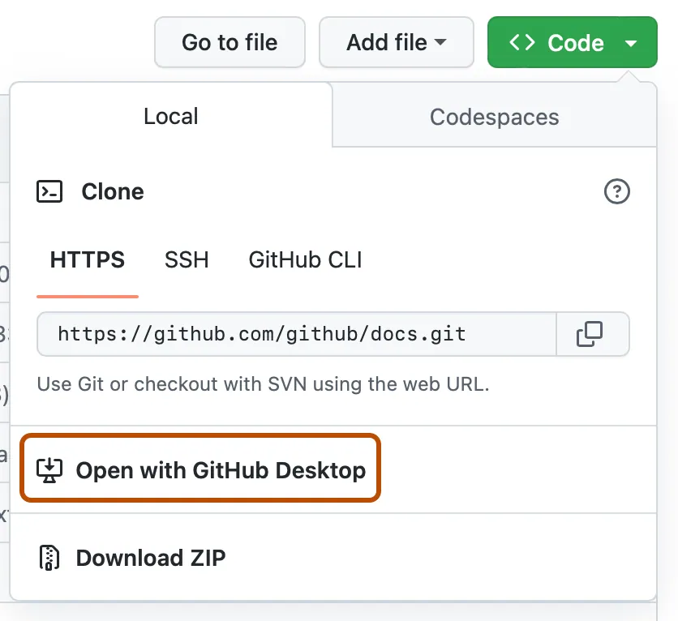

## Activate Auth0 Tenant

An Auth0 tenant has been created for you. To the right of this page click the **Accept Invitation** button and follow the steps. This will launch you into the Auth0 management dashboard.

You now have an Auth0 tenant for providing identity services for your applications. You will have access to this tenant for <mark>**30 days**</mark>.

### Verify lab bootstrap

* **Application**: a *Regular Web App* named <kbd>the bAInk</kbd> should have been created.
  * **Allowed Callback URLs**: `http://localhost:3000/auth/callback`
  * **Allowed Logout URLs**: `http://localhost:3000`
  * **Allowed Web Origins**: `http://localhost:3000`
<!-- * **MFA (SMS)**: the tenant is configured to use `https://sms.atko.rocks` for the SMS gateway. -->

<br>

> [!TIP]
> If something is missing, don’t panic — Aiya can help you manually "re‑bootstrap" from inside the app.
>
> *Or ask a lab attendant for assistance.*

<br>

## Clone the Repo

You can clone the repo using the UI ***OR*** via command line.

<br>

> [!TIP]
> Need a refresher on cloning a repo? No worries. We [got you](https://docs.github.com/en/repositories/creating-and-managing-repositories/cloning-a-repository).

<br>

#### Command Line (*easiest*)
##### STEP 1
```bash
git clone https://github.com/udplabs/auth0-ai
```
##### STEP 2
```bash
cd auth0-ai
```
<br>

> [!IMPORTANT]
> Remember to navigate (`cd auth0-ai`) to the directory where you have cloned the repo!

<br>

<details>
<summary><h4>Alternative Option: Github Desktop</h4></summary>
*You will need to have Github Desktop installed*.
1. Navigate to the [repo](#).
2. From the main page click on the **<> Code** button.
   
3. Click on **Open with GithHub Desktop**
   
4. Follow the prompts in GitHub Desktop.

<br>

  > [!NOTE]
  > Refer to [GitHub's instructions](https://docs.github.com/en/repositories/creating-and-managing-repositories/cloning-a-repository?tool=desktop) for further details on cloning a repo using GitHub Desktop.

<br>
</details>


---
#### *Great! Let's continue to the get the app started up.*